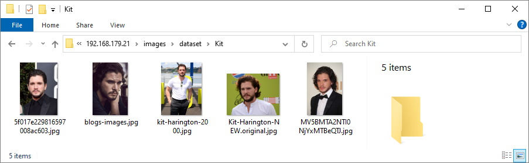
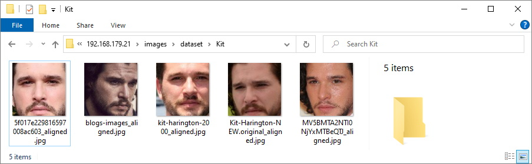

# recface

The face recognition system for NVIDIA Jetson Nano. What this system can do:
- Captures images from the camera.
- Detect the faces on the captured images.
- Performs face recognition and create a feature embedding of faces.
- Sends the embedding to a pre-trained classifier in order to determine whether a person belongs to a known class.
- If the embedding belongs to a person existing in the classifier database, a banner is displayed about successful recognition.
- Sends a control signal for the electronic lock system to connector "J41".
- For face detection and recognition, it uses the [NVIDIA TensorRT](https://developer.nvidia.com/tensorrt) library for the best performance.
- Contains utilities for creating a classifier database from person images.

What this system can't do:
- The system does not have the liveness module for detecting fakes. Therefore, it can only be used for educational purposes.

This project is a graduation project of a student of the [University of Artificial Intelligence](https://neural-university.ru/).

An example of how the system works can be seen in this video:

> The video uses an old version of "recface" runtime, which has not been optimized. 
> The performance of the latest version has been significantly improved (FPS: 25-30)

Platform Specification

 

Hardware:

- NVidia Jetson Nano Developer Kit (B01)
- Camera for Jetson Nano (IMX219-77)
- Jetson Nano Wireless Card (8265AC NGW)
- Noctua A4x20 5V PWM Fan
- Acrylic Case for Jetson Nano
- DC Power Supply (5V, 4A)

Software:
  
- NVIDIA JetPack 4.5.1 SDK
- Linux 4 Tegra 32.5.1
- TensorRT 7.1.3.0
- Python 3.6.9
- OpenCV 4.5.3
- Scikit-learn 0.24.1
- RecFace for Jetson runtime

Neural Network Models:

- Face detection: Single Shot-Multibox Detector (SSD)
- Face recognition: MobileFaceNetV2 (512-D embeddings)
- Classifier: Sklearn SVC

Performance:

- CPU RAM Usage: 1.7 GB
- GPU RAM Usage: 400 MB
- FPS: 25-30
- LFW Aligned Accuracy: 0.99383

## Installation

The project is optimized to work with [NVIDIA JetPack 4.5](https://developer.nvidia.com/jetpack-sdk-45-archive). If you want to use other versions of "JetPack", then you need to change the project code to work with other versions of the TensorRT library. The project code works with the TensorRT library version 7.1. Next, a step-by-step installation of the software from scratch will be described:

JetPack SDK installation procedure

 
You will need a microSD card with a minimum size of 32 GB. 

- Download the archive "jetson-nano-jp45-sd-card-image.zip" from [NVIDIA archive page](https://developer.nvidia.com/jetpack-sdk-45-archive)
- Write to the microSD card the image from the archive "jetson-nano-jp45-sd-card-image.zip".
- Install the card into the "Jetson Nano". Connect a USB keyboard, mouse and monitor. Boot the Nano from the card.
- Accept the terms of licenses
- Select language: English
- Select keyboard layout: English (US)
- Choose "I don't want to connect" on the Wireless page
- Select your Timezone
- Fill the form on page "Who are you?":
  - Your name: user
  - Your computer's name: jetson
  - Pick a username: user
  - Choose a password
  - Select "Require my password to log in"
- Set the desired size of APP partition: select maximum accepted size
- Set Nvpmodel Mode: MAXN (Default)
- Boot to OS

Connecting Nano to the local network and Internet

 
You need to connect the Nano to your local network and Internet. For example, I'll connect the Nano over Wi-Fi. 

- Login in to the GUI as "user" using a monitor, keyboard and mouse.
- Run the Terminal app

<pre>
<b>user@jetson:~$ sudo iwlist wlan0 scan</b>
[sudo] password for user:
wlan0     Scan completed :
          Cell 01 - Address: 74:4D:28:11:11:11
                    Channel:157
                    Frequency:5.785 GHz
                    Quality=65/70  Signal level=-45 dBm
                    Encryption key:on
                    ESSID:"Zion5"
                    Bit Rates:6 Mb/s; 9 Mb/s; 12 Mb/s; 18 Mb/s; 24 Mb/s
                              36 Mb/s; 48 Mb/s; 54 Mb/s
                    Mode:Master
                    Extra:tsf=0000001111111111
                    Extra: Last beacon: 336ms ago
          Cell 02 - Address: 74:4D:28:11:11:12
                    Channel:11
                    Frequency:2.462 GHz (Channel 11)
                    Quality=52/70  Signal level=-58 dBm
                    Encryption key:on
                    ESSID:"Zion"
                    Bit Rates:1 Mb/s; 2 Mb/s; 5.5 Mb/s; 11 Mb/s; 6 Mb/s
                              9 Mb/s; 12 Mb/s; 18 Mb/s
                    Bit Rates:24 Mb/s; 36 Mb/s; 48 Mb/s; 54 Mb/s
                    Mode:Master
                    Extra:tsf=000000001111111112
                    Extra: Last beacon: 556ms ago 
<b>user@jetson:~$ nmcli dev wifi list</b>
IN-USE  SSID   MODE   CHAN  RATE        SIGNAL  BARS  SECURITY
        Zion   Infra  1     195 Mbit/s  87      ▂▄█  WPA2
        Zion5  Infra  157   405 Mbit/s  75      ▂▄_  WPA2
</pre>

> Choose your own Wi-Fi SSID and replace the word PASS with your Wi-Fi password:
<pre>
<b>user@jetson:~$ sudo nmcli dev wifi connect Zion5 password PASS</b>
Device 'wlan0' successfully activated with '6abcef5f-bb1d-486d-9fc9-0c9057c47c71'. 
<b>user@jetson:~$ nmcli con show</b>
NAME                UUID                                  TYPE      DEVICE
Zion5               6abcef5f-bb1d-486d-9fc9-0c9057c47c71  wifi      wlan0
Wired connection 1  8eeaabe4-543c-3c3b-a860-ad7959d737c4  ethernet  --
</pre>

> Replace the Wi-Fi SSID and IP addresses with your own LAN addresses:
<pre>
<b>user@jetson:~$ sudo nmcli con modify Zion5 ipv4.addresses 192.168.179.21/24</b>
<b>user@jetson:~$ sudo nmcli con modify Zion5 ipv4.method manual</b>
<b>user@jetson:~$ sudo nmcli con modify Zion5 ipv4.gateway 192.168.179.1</b>
<b>user@jetson:~$ sudo nmcli con modify Zion5 ipv4.dns 192.168.179.1</b>
</pre>

> Modify and save the contents of the file:
<pre>
<b>user@jetson:~$ sudo vi /etc/NetworkManager/conf.d/default-wifi-powersave-on.conf</b>
<i>[connection]
wifi.powersave = 2</i> 
<b>user@jetson:~$ sudo systemctl restart NetworkManager</b>
<b>user@jetson:~$ ip a</b>
1: lo: <LOOPBACK,UP,LOWER_UP> mtu 65536 qdisc noqueue state UNKNOWN group default qlen 1
    link/loopback 00:00:00:00:00:00 brd 00:00:00:00:00:00
    inet 127.0.0.1/8 scope host lo
       valid_lft forever preferred_lft forever
    inet6 ::1/128 scope host
       valid_lft forever preferred_lft forever
2: dummy0: <BROADCAST,NOARP> mtu 1500 qdisc noop state DOWN group default qlen 1000
    link/ether 76:14:6c:0c:fe:60 brd ff:ff:ff:ff:ff:ff
3: eth0: <NO-CARRIER,BROADCAST,MULTICAST,UP> mtu 1500 qdisc pfifo_fast state DOWN group default qlen 1000
    link/ether 00:04:4b:11:11:11 brd ff:ff:ff:ff:ff:ff
7: wlan0: <BROADCAST,MULTICAST,UP,LOWER_UP> mtu 1500 qdisc mq state UP group default qlen 1000
    link/ether 14:4f:8a:11:11:11 brd ff:ff:ff:ff:ff:ff
    inet 192.168.179.21/24 brd 192.168.179.255 scope global noprefixroute wlan0
       valid_lft forever preferred_lft forever
    inet6 fe80::8b1a:af31:a44:139c/64 scope link noprefixroute
       valid_lft forever preferred_lft forever
8: l4tbr0: <BROADCAST,MULTICAST> mtu 1500 qdisc noop state DOWN group default qlen 1000
    link/ether 26:60:42:4c:a7:05 brd ff:ff:ff:ff:ff:ff
9: rndis0: <NO-CARRIER,BROADCAST,MULTICAST,UP> mtu 1500 qdisc pfifo_fast master l4tbr0 state DOWN group default qlen 1000
    link/ether 26:60:42:4c:a7:05 brd ff:ff:ff:ff:ff:ff
10: usb0: <NO-CARRIER,BROADCAST,MULTICAST,UP> mtu 1500 qdisc pfifo_fast master l4tbr0 state DOWN group default qlen 1000
    link/ether 26:60:42:4c:a7:07 brd ff:ff:ff:ff:ff:ff 
</pre>

- Connect to Nano via SSH. Login as "user".
<pre>
<b>user@jetson:~$ iwconfig wlan0 | grep "Power Management"</b>
          Power Management:off
</pre>

Prepare OS Linux

 
Removing unnecessary packages. Performing an OS update. 

<pre>
<b>user@jetson:~$ sudo systemctl stop snapd.service snapd.socket</b>
<b>user@jetson:~$ sudo apt autoremove --purge snapd gnome-software-plugin-snap</b>
Reading package lists... Done
Building dependency tree
Reading state information... Done
The following packages will be REMOVED:
  apt-clone* archdetect-deb* bogl-bterm* busybox-static* cryptsetup-bin* dpkg-repack* gir1.2-timezonemap-1.0* gir1.2-xkl-1.0* gnome-software-plugin-snap* grub-common* kde-window-manager* kinit* kio* kpackagetool5* kwayland-data*
  kwin-common* kwin-data* kwin-x11* libdebian-installer4* libkdecorations2-5v5* libkdecorations2private5v5* libkf5activities5* libkf5attica5* libkf5completion-data* libkf5completion5* libkf5declarative-data* libkf5declarative5*
  libkf5doctools5* libkf5globalaccel-data* libkf5globalaccel5* libkf5globalaccelprivate5* libkf5idletime5* libkf5jobwidgets-data* libkf5jobwidgets5* libkf5kcmutils-data* libkf5kcmutils5* libkf5kiocore5* libkf5kiontlm5*
  libkf5kiowidgets5* libkf5newstuff-data* libkf5newstuff5* libkf5newstuffcore5* libkf5package-data* libkf5package5* libkf5plasma5* libkf5quickaddons5* libkf5solid5* libkf5solid5-data* libkf5sonnet5-data* libkf5sonnetcore5*
  libkf5sonnetui5* libkf5textwidgets-data* libkf5textwidgets5* libkf5waylandclient5* libkf5waylandserver5* libkf5xmlgui-bin* libkf5xmlgui-data* libkf5xmlgui5* libkscreenlocker5* libkwin4-effect-builtins1* libkwineffects11*
  libkwinglutils11* libkwinxrenderutils11* libqgsttools-p1* libqt5designer5* libqt5help5* libqt5multimedia5* libqt5multimedia5-plugins* libqt5multimediaquick-p5* libqt5multimediawidgets5* libqt5opengl5* libqt5quickwidgets5* libqt5sql5*
  libqt5test5* libxcb-composite0* libxcb-cursor0* libxcb-damage0* os-prober* python3-dbus.mainloop.pyqt5* python3-icu* python3-pam* python3-pyqt5* python3-pyqt5.qtsvg* python3-pyqt5.qtwebkit* python3-sip*
  qml-module-org-kde-kquickcontrolsaddons* qml-module-qtmultimedia* qml-module-qtquick2* rdate* snapd* tasksel* tasksel-data*
0 upgraded, 0 newly installed, 92 to remove and 279 not upgraded.
After this operation, 211 MB disk space will be freed.
Do you want to continue? [Y/n] y 
<b>user@jetson:~$ sudo rm -rf /var/cache/snapd</b>
<b>user@jetson:~$ sudo systemctl stop docker.service docker.socket</b>
<b>user@jetson:~$ sudo apt autoremove --purge docker docker.io nvidia-docker2</b>
Reading package lists... Done
Building dependency tree
Reading state information... Done
The following packages will be REMOVED:
  cgroupfs-mount* containerd* docker* docker.io* nvidia-docker2* pigz* runc* ubuntu-fan*
0 upgraded, 0 newly installed, 8 to remove and 276 not upgraded.
After this operation, 258 MB disk space will be freed.
Do you want to continue? [Y/n] y 
<b>user@jetson:~$ sudo apt autoremove --purge nvidia-l4t-bootloader</b>
Reading package lists... Done
Building dependency tree
Reading state information... Done
The following packages will be REMOVED:
  nvidia-l4t-bootloader*
0 upgraded, 0 newly installed, 1 to remove and 275 not upgraded.
After this operation, 10,8 MB disk space will be freed.
Do you want to continue? [Y/n] y 
<b>user@jetson:~$ sudo systemctl stop nv-l4t-usb-device-mode.service</b>
<b>user@jetson:~$ sudo systemctl disable nv-l4t-usb-device-mode.service</b>
Removed /etc/systemd/system/multi-user.target.wants/nv-l4t-usb-device-mode.service.
Removed /etc/systemd/system/nv-l4t-usb-device-mode.service. 
<b>user@jetson:~$ sudo apt update</b>
Get:1 file:/var/cuda-repo-10-2-local-10.2.89  InRelease
Ign:1 file:/var/cuda-repo-10-2-local-10.2.89  InRelease
Get:2 file:/var/visionworks-repo  InRelease
Ign:2 file:/var/visionworks-repo  InRelease
Get:3 file:/var/visionworks-sfm-repo  InRelease
Ign:3 file:/var/visionworks-sfm-repo  InRelease
Get:4 file:/var/visionworks-tracking-repo  InRelease
Ign:4 file:/var/visionworks-tracking-repo  InRelease
Get:5 file:/var/cuda-repo-10-2-local-10.2.89  Release [574 B]
Get:5 file:/var/cuda-repo-10-2-local-10.2.89  Release [574 B]
Get:6 file:/var/visionworks-repo  Release [2 001 B]
Get:6 file:/var/visionworks-repo  Release [2 001 B]
Get:7 file:/var/visionworks-sfm-repo  Release [2 005 B]
Get:7 file:/var/visionworks-sfm-repo  Release [2 005 B]
Get:8 file:/var/visionworks-tracking-repo  Release [2 010 B]
Get:8 file:/var/visionworks-tracking-repo  Release [2 010 B]
Hit:10 http://ports.ubuntu.com/ubuntu-ports bionic InRelease
Hit:12 http://ports.ubuntu.com/ubuntu-ports bionic-updates InRelease
Hit:13 https://repo.download.nvidia.com/jetson/common r32.5 InRelease
Hit:15 http://ports.ubuntu.com/ubuntu-ports bionic-backports InRelease
Hit:16 http://ports.ubuntu.com/ubuntu-ports bionic-security InRelease
Hit:17 https://repo.download.nvidia.com/jetson/t210 r32.5 InRelease
Reading package lists... Done
Building dependency tree
Reading state information... Done
275 packages can be upgraded. Run 'apt list --upgradable' to see them. 
<b>user@jetson:~$ sudo apt upgrade</b>
Reading package lists... Done
Building dependency tree
Reading state information... Done
Calculating upgrade... Done
The following NEW packages will be installed:
  nvidia-l4t-libvulkan python3-click python3-colorama
The following packages will be upgraded:
  apport apport-gtk apt aptdaemon aptdaemon-data aspell avahi-autoipd avahi-daemon avahi-utils bind9-host binutils binutils-aarch64-linux-gnu binutils-common bluez bluez-obexd ca-certificates chromium-browser chromium-browser-l10n
  chromium-codecs-ffmpeg-extra cmake cmake-data dirmngr distro-info-data dnsmasq-base file-roller ghostscript ghostscript-x gir1.2-appindicator3-0.1 gir1.2-gst-plugins-base-1.0 gir1.2-gstreamer-1.0 gir1.2-javascriptcoregtk-4.0
  gir1.2-mutter-2 gir1.2-snapd-1 gir1.2-webkit2-4.0 git git-man gnome-shell gnome-shell-common gnupg gnupg-l10n gnupg-utils gpg gpg-agent gpg-wks-client gpg-wks-server gpgconf gpgsm gpgv gstreamer1.0-alsa gstreamer1.0-gl
  gstreamer1.0-gtk3 gstreamer1.0-plugins-base gstreamer1.0-plugins-base-apps gstreamer1.0-plugins-good gstreamer1.0-pulseaudio gstreamer1.0-tools gstreamer1.0-x gzip imagemagick imagemagick-6-common imagemagick-6.q16 initramfs-tools
  initramfs-tools-bin initramfs-tools-core iproute2 isc-dhcp-client isc-dhcp-common isc-dhcp-server jetson-gpio-common libappindicator1 libappindicator3-1 libapt-inst2.0 libapt-pkg5.0 libarchive13 libasound2 libasound2-data
  libasound2-dev libaspell15 libaudit-common libaudit1 libavahi-client3 libavahi-common-data libavahi-common3 libavahi-core7 libavahi-glib1 libavahi-ui-gtk3-0 libbind9-160 libbinutils libbluetooth3 libc-bin libc-dev-bin libc6 libc6-dbg
  libc6-dev libcaca0 libcurl3-gnutls libcurl4 libdjvulibre-text libdjvulibre21 libdns-export1100 libdns1100 libevdev2 libexiv2-14 libglib2.0-0 libglib2.0-bin libglib2.0-data libglib2.0-dev libglib2.0-dev-bin libgnome-autoar-0-0 libgs9
  libgs9-common libgstreamer-gl1.0-0 libgstreamer-plugins-base1.0-0 libgstreamer-plugins-base1.0-dev libgstreamer-plugins-good1.0-0 libgstreamer1.0-0 libgstreamer1.0-dev libhogweed4 libinput-bin libinput10 libirs-export160
  libisc-export169 libisc169 libisccc160 libisccfg-export160 libisccfg160 libjavascriptcoregtk-4.0-18 libldap-2.4-2 libldap-common libldb1 liblwres160 liblz4-1 libmagickcore-6.q16-3 libmagickcore-6.q16-3-extra libmagickwand-6.q16-3
  libmutter-2-0 libmysqlclient20 libnettle6 libnss-myhostname libnss-systemd libnvvpi1 libopenexr22 libp11-kit0 libpam-modules libpam-modules-bin libpam-runtime libpam-systemd libpam0g libproxy1-plugin-gsettings
  libproxy1-plugin-networkmanager libproxy1v5 libpython2.7 libpython2.7-dev libpython2.7-minimal libpython2.7-stdlib libpython3.6 libpython3.6-minimal libpython3.6-stdlib librados2 librbd1 libsasl2-2 libsasl2-modules
  libsasl2-modules-db libseccomp2 libsmbclient libsnapd-glib1 libsndfile1 libssl1.0.0 libssl1.1 libsystemd0 libtiff5 libudev1 libwavpack1 libwbclient0 libwebkit2gtk-4.0-37 libwebp6 libwebpdemux2 libwebpmux3 libwhoopsie0 libx11-6
  libx11-data libx11-dev libx11-doc libx11-xcb-dev libx11-xcb1 libxml2 libxml2-dev libzstd1 linux-base linux-firmware linux-libc-dev locales lshw multiarch-support mutter mutter-common nfs-common nvidia-l4t-3d-core
  nvidia-l4t-apt-source nvidia-l4t-camera nvidia-l4t-configs nvidia-l4t-core nvidia-l4t-cuda nvidia-l4t-firmware nvidia-l4t-graphics-demos nvidia-l4t-gstreamer nvidia-l4t-init nvidia-l4t-initrd nvidia-l4t-jetson-io
  nvidia-l4t-jetson-multimedia-api nvidia-l4t-kernel nvidia-l4t-kernel-dtbs nvidia-l4t-kernel-headers nvidia-l4t-multimedia nvidia-l4t-multimedia-utils nvidia-l4t-oem-config nvidia-l4t-tools nvidia-l4t-wayland nvidia-l4t-weston
  nvidia-l4t-x11 nvidia-l4t-xusb-firmware openssh-client openssh-server openssh-sftp-server openssl p11-kit p11-kit-modules python-apt-common python-jetson-gpio python2.7 python2.7-dev python2.7-minimal python3-apport python3-apt
  python3-aptdaemon python3-aptdaemon.gtk3widgets python3-distupgrade python3-httplib2 python3-jetson-gpio python3-lxml python3-problem-report python3-xdg python3.6 python3.6-minimal rpcbind samba-libs squashfs-tools sudo systemd
  systemd-sysv tar thunderbird thunderbird-gnome-support tzdata ubuntu-drivers-common ubuntu-keyring ubuntu-release-upgrader-core ubuntu-release-upgrader-gtk udev unzip update-notifier update-notifier-common vpi1-demos vpi1-dev
  vpi1-samples whoopsie wireless-regdb wpasupplicant xdg-utils xserver-common xserver-xephyr xserver-xorg-core xserver-xorg-legacy xterm xwayland
275 upgraded, 3 newly installed, 0 to remove and 0 not upgraded.
Need to get 570 MB of archives.
After this operation, 117 MB of additional disk space will be used.
Do you want to continue? [Y/n] y 
<b>user@jetson:~$ sudo systemctl disable avahi-daemon.service bluetooth.service apt-daily-upgrade.timer apt-daily.timer motd-news.timer</b>
Synchronizing state of avahi-daemon.service with SysV service script with /lib/systemd/systemd-sysv-install.
Executing: /lib/systemd/systemd-sysv-install disable avahi-daemon
Synchronizing state of bluetooth.service with SysV service script with /lib/systemd/systemd-sysv-install.
Executing: /lib/systemd/systemd-sysv-install disable bluetooth
Removed /etc/systemd/system/dbus-org.freedesktop.Avahi.service.
Removed /etc/systemd/system/timers.target.wants/apt-daily.timer.
Removed /etc/systemd/system/timers.target.wants/apt-daily-upgrade.timer.
Removed /etc/systemd/system/timers.target.wants/motd-news.timer.
Removed /etc/systemd/system/sockets.target.wants/avahi-daemon.socket.
Removed /etc/systemd/system/dbus-org.bluez.service.
</pre>

> Modify and save the contents of the file:
<pre>
<b>user@jetson:~$ sudo vi /etc/default/apport</b>
<i># set this to 0 to disable apport, or to 1 to enable it
# you can temporarily override this with
# sudo service apport start force_start=1
enabled=0</i> 
<b>user@jetson:~$ sudo reboot</b>
</pre>

Setup the Display Manager and VNC server

 
We will use the "LightDM" display manager instead of the "Gnome", since it uses less memory. 

- Connect to Nano via SSH. Login as "user".
<pre>
<b>user@jetson:~$ sudo dpkg-reconfigure lightdm</b>
</pre>

> Select "Lightdm" on the menu.
<pre>
<b>user@jetson:~$ sudo useradd -m recface -s /bin/bash</b>
</pre>

> Choose a password for the "recface" account:
<pre>
<b>user@jetson:~$ sudo passwd recface</b>
Enter new UNIX password:
Retype new UNIX password:
passwd: password updated successfully 
<b>user@jetson:~$ sudo usermod -a -G sudo recface</b>
<b>user@jetson:~$ sudo usermod -a -G video recface</b>
</pre>

> Create and save the contents of the file:
<pre>
<b>user@jetson:~$ sudo vi /etc/lightdm/lightdm.conf.d/01-username.conf</b>
<i>[SeatDefaults]
autologin-user=recface
autologin-user-timeout=0</i>
</pre>

> Modify and save the contents of the file:
<pre>
<b>user@jetson:~$ sudo vi /etc/X11/xorg.conf</b>
<i># Copyright (c) 2011-2013 NVIDIA CORPORATION.  All Rights Reserved. 
#
# This is the minimal configuration necessary to use the Tegra driver.
# Please refer to the xorg.conf man page for more configuration
# options provided by the X server, including display-related options
# provided by RandR 1.2 and higher. 
# Disable extensions not useful on Tegra.
Section "Module"
    Disable     "dri"
    SubSection  "extmod"
        Option  "omit xfree86-dga"
    EndSubSection
EndSection 
Section "Device"
    Identifier  "Tegra0"
    Driver      "nvidia"
# Allow X server to be started even if no display devices are connected.
    Option      "AllowEmptyInitialConfiguration" "true"
EndSection 
Section "Screen"
   Identifier    "Default Screen"
   Monitor       "Configured Monitor"
   Device        "Tegra0"
   SubSection "Display"
       Depth    24
       Virtual 1280 720 # Modify the resolution by editing these values
   EndSubSection
EndSection 
Section "ServerFlags"
   Option "BlankTime" "0"
   Option "StandbyTime" "0"
   Option "SuspendTime" "0"
   Option "OffTime" "0"
EndSection</i> 
<b>user@jetson:~$ sudo reboot</b>
</pre>

- Connect to Nano via SSH. Login as "recface". Enter the password that was set earlier.
<pre>
<b>recface@jetson:~$ mkdir -p ~/.config/autostart</b>
<b>recface@jetson:~$ cp /usr/share/applications/vino-server.desktop ~/.config/autostart/</b>
<b>recface@jetson:~$ gsettings set org.gnome.Vino prompt-enabled false</b>
<b>recface@jetson:~$ gsettings set org.gnome.Vino require-encryption false</b>
<b>recface@jetson:~$ gsettings set org.gnome.Vino authentication-methods "['vnc']"</b>
</pre>

> Replace the word 'password' with your own password. It's the password that will need to be used to access through the VNC client:
<pre>
<b>recface@jetson:~$ gsettings set org.gnome.Vino vnc-password $(echo -n 'password'|base64)</b>
<b>recface@jetson:~$ gsettings list-recursively org.gnome.Vino</b>
org.gnome.Vino notify-on-connect true
org.gnome.Vino alternative-port uint16 5900
org.gnome.Vino disable-background false
org.gnome.Vino use-alternative-port false
org.gnome.Vino icon-visibility 'client'
org.gnome.Vino use-upnp false
org.gnome.Vino view-only false
org.gnome.Vino prompt-enabled false
org.gnome.Vino disable-xdamage false
org.gnome.Vino authentication-methods ['vnc']
org.gnome.Vino network-interface ''
org.gnome.Vino require-encryption false
org.gnome.Vino mailto ''
org.gnome.Vino lock-screen-on-disconnect false
org.gnome.Vino vnc-password 'YmN111111' 
<b>recface@jetson:~$ sudo apt autoremove --purge gnome-screensaver</b>
Reading package lists... Done
Building dependency tree
Reading state information... Done
The following packages will be REMOVED:
  gnome-screensaver*
0 upgraded, 0 newly installed, 1 to remove and 0 not upgraded.
After this operation, 1 361 kB disk space will be freed.
Do you want to continue? [Y/n] y 
<b>recface@jetson:~$ sudo reboot</b>
</pre>

- Connect to Nano via VNC client ([TightVNC](https://tightvnc.com/) for example). Enter the password that was set earlier.
- In the VNC window go to the menu "Preferences - Screensaver"
- Set the MODE setting to "Disable Screen Saver"

Setup the Fan Daemon (optional)

 
If you are using a 4-pin PWM cooling fan such as "Noctua A4x20 5V PWM Fan", then you need software to control the fan speed. I recommend the <a href="https://github.com/hooperbill/fan-daemon" target="_blank">fan-daemon</a> project. 

- Connect to Nano via SSH. Login as "recface".
<pre>
<b>recface@jetson:~$ git clone https://github.com/hooperbill/fan-daemon.git</b>
Cloning into 'fan-daemon'...
remote: Enumerating objects: 51, done.
remote: Counting objects: 100% (4/4), done.
remote: Compressing objects: 100% (4/4), done.
remote: Total 51 (delta 0), reused 1 (delta 0), pack-reused 47
Unpacking objects: 100% (51/51), done. 
<b>recface@jetson:~$ cd fan-daemon/</b>
<b>recface@jetson:~/fan-daemon$ make all</b>
test -d bin/Release || mkdir -p bin/Release
test -d obj/Release || mkdir -p obj/Release
g++ -Wall -fexceptions -Os -std=c++11  -c fan-daemon.cpp -o obj/Release/fan-daemon.o
fan-daemon.cpp: In function ‘int main(int, char**)’:
fan-daemon.cpp:69:11: warning: ignoring return value of ‘int system(const char*)’, declared with attribute warn_unused_result [-Wunused-result]
     system(JETSON_CLOCKS);
     ~~~~~~^~~~~~~~~~~~~~~
g++  -o bin/Release/fan-daemon obj/Release/fan-daemon.o   -s 
<b>recface@jetson:~/fan-daemon$ sudo ./install.sh</b>
setting to /usr/local/bin/fan-daemon/...
done
adding service to /lib/systemd/system/...
done
starting and enabling service...
Created symlink /etc/systemd/system/multi-user.target.wants/fan-daemon.service → /lib/systemd/system/fan-daemon.service.
done
fan-daemon installed sucessfully! 
<b>recface@jetson:~/fan-daemon$ cd</b>
<b>recface@jetson:~$ sudo systemctl status fan-daemon</b>
● fan-daemon.service - Fan control daemon
   Loaded: loaded (/lib/systemd/system/fan-daemon.service; enabled; vendor preset: enabled)
   Active: active (running) since Sat 2021-08-21 22:40:33 MSK; 12s ago
 Main PID: 4781 (fan-daemon)
    Tasks: 1 (limit: 4180)
   CGroup: /system.slice/fan-daemon.service
           └─4781 /usr/local/bin/fan-daemon/fan-daemon 
авг 21 22:40:33 jetson systemd[1]: Started Fan control daemon. 
</pre>

Installing the "OpenCV" library with GPU support

 
To install the "OpenCV" library with GPU support, you need to compile it from source. For this I recommend using the "Jetson Nano" model with 4 GB memory. 

- Connect to Nano via SSH. Login as "recface".
<pre>
<b>recface@jetson:~$ sudo apt autoremove --purge libopencv libopencv-dev libopencv-python libopencv-samples opencv-licenses</b>
[sudo] password for recface:
Reading package lists... Done
Building dependency tree
Reading state information... Done
The following packages will be REMOVED:
  libopencv* libopencv-dev* libopencv-python* libopencv-samples* opencv-licenses* vpi1-samples*
0 upgraded, 0 newly installed, 6 to remove and 0 not upgraded.
After this operation, 85,0 MB disk space will be freed.
Do you want to continue? [Y/n] y 
<b>recface@jetson:~$ sudo apt-get install build-essential cmake libavcodec-dev libavformat-dev libavutil-dev libeigen3-dev libglew-dev libgtk2.0-dev libgtk-3-dev libjpeg-dev libpng-dev libpostproc-dev libswscale-dev libtbb-dev libtiff5-dev libv4l-dev libxvidcore-dev libx264-dev qt5-default zlib1g-dev pkg-config python3-dev python3-numpy python3-py python3-pytest libgstreamer1.0-dev libgstreamer-plugins-base1.0-dev libavresample-dev libdc1394-22-dev</b>
Reading package lists... Done
Building dependency tree
Reading state information... Done
build-essential is already the newest version (12.4ubuntu1).
build-essential set to manually installed.
pkg-config is already the newest version (0.29.1-0ubuntu2).
pkg-config set to manually installed.
python3-numpy is already the newest version (1:1.13.3-2ubuntu1).
python3-numpy set to manually installed.
zlib1g-dev is already the newest version (1:1.2.11.dfsg-0ubuntu2).
zlib1g-dev set to manually installed.
libeigen3-dev is already the newest version (3.3.4-4).
libeigen3-dev set to manually installed.
libtbb-dev is already the newest version (2017~U7-8).
cmake is already the newest version (3.10.2-1ubuntu2.18.04.2).
libgstreamer-plugins-base1.0-dev is already the newest version (1.14.5-0ubuntu1~18.04.3).
libgstreamer-plugins-base1.0-dev set to manually installed.
libgstreamer1.0-dev is already the newest version (1.14.5-0ubuntu1~18.04.2).
libgstreamer1.0-dev set to manually installed.
python3-dev is already the newest version (3.6.7-1~18.04).
python3-dev set to manually installed.
The following additional packages will be installed:
  gir1.2-gtk-2.0 libatk-bridge2.0-dev libatk1.0-dev libatspi2.0-dev libcairo-script-interpreter2 libcairo2-dev libdbus-1-dev libepoxy-dev libfontconfig1-dev libfreetype6-dev libgdk-pixbuf2.0-dev libglew2.0 libjbig-dev
  libjpeg-turbo8-dev libjpeg8-dev liblzma-dev libpango1.0-dev libpixman-1-dev libpng-tools libqt5concurrent5 libqt5opengl5 libqt5opengl5-dev libqt5sql5 libqt5sql5-sqlite libqt5test5 libraw1394-dev libraw1394-tools libswresample-dev
  libtiffxx5 libv4l2rds0 libxcb-shm0-dev libxcomposite-dev libxcursor-dev libxft-dev libxinerama-dev libxkbcommon-dev libxml2-utils libxtst-dev python3-attr python3-pluggy qt5-qmake qt5-qmake-bin qtbase5-dev qtbase5-dev-tools
  wayland-protocols x11proto-composite-dev x11proto-record-dev x11proto-xinerama-dev
Suggested packages:
  libcairo2-doc glew-utils libgtk-3-doc libgtk2.0-doc liblzma-doc libpango1.0-doc libraw1394-doc python-attr-doc subversion default-libmysqlclient-dev firebird-dev libpq-dev libsqlite3-dev unixodbc-dev
The following NEW packages will be installed:
  gir1.2-gtk-2.0 libatk-bridge2.0-dev libatk1.0-dev libatspi2.0-dev libavcodec-dev libavformat-dev libavresample-dev libavutil-dev libcairo-script-interpreter2 libcairo2-dev libdbus-1-dev libdc1394-22-dev libepoxy-dev
  libfontconfig1-dev libfreetype6-dev libgdk-pixbuf2.0-dev libglew-dev libglew2.0 libgtk-3-dev libgtk2.0-dev libjbig-dev libjpeg-dev libjpeg-turbo8-dev libjpeg8-dev liblzma-dev libpango1.0-dev libpixman-1-dev libpng-dev libpng-tools
  libpostproc-dev libqt5concurrent5 libqt5opengl5 libqt5opengl5-dev libqt5sql5 libqt5sql5-sqlite libqt5test5 libraw1394-dev libraw1394-tools libswresample-dev libswscale-dev libtiff5-dev libtiffxx5 libv4l-dev libv4l2rds0 libx264-dev
  libxcb-shm0-dev libxcomposite-dev libxcursor-dev libxft-dev libxinerama-dev libxkbcommon-dev libxml2-utils libxtst-dev libxvidcore-dev python3-attr python3-pluggy python3-py python3-pytest qt5-default qt5-qmake qt5-qmake-bin
  qtbase5-dev qtbase5-dev-tools wayland-protocols x11proto-composite-dev x11proto-record-dev x11proto-xinerama-dev
0 upgraded, 67 newly installed, 0 to remove and 0 not upgraded.
Need to get 19,8 MB of archives.
After this operation, 107 MB of additional disk space will be used.
Do you want to continue? [Y/n] y 
<b>recface@jetson:~$ mkdir opencv-4.5.3</b>
<b>recface@jetson:~$ cd opencv-4.5.3/</b>
<b>recface@jetson:~/opencv-4.5.3$ wget https://github.com/opencv/opencv/archive/4.5.3.zip -O opencv.zip</b>
<b>recface@jetson:~/opencv-4.5.3$ wget https://github.com/opencv/opencv_contrib/archive/4.5.3.zip -O opencv_contrib.zip</b>
<b>recface@jetson:~/opencv-4.5.3$ unzip opencv.zip</b>
<b>recface@jetson:~/opencv-4.5.3$ unzip opencv_contrib.zip</b>
<b>recface@jetson:~/opencv-4.5.3$ mv opencv-4.5.3 opencv</b>
<b>recface@jetson:~/opencv-4.5.3$ mv opencv_contrib-4.5.3 opencv_contrib</b>
<b>recface@jetson:~/opencv-4.5.3$ rm opencv_contrib.zip opencv.zip</b>
<b>recface@jetson:~/opencv-4.5.3$ cd opencv</b>
<b>recface@jetson:~/opencv-4.5.3/opencv$ mkdir build</b>
<b>recface@jetson:~/opencv-4.5.3/opencv$ cd build/</b>
</pre>

> If you want to get smooth video work, then do not enable the "QT" support. Best of all, leave the "cmake" configuration command as in this manual:
<pre>
<b>recface@jetson:~/opencv-4.5.3/opencv/build$ cmake -D CMAKE_BUILD_TYPE=RELEASE \
-D CMAKE_INSTALL_PREFIX=/usr/local \
-D OPENCV_EXTRA_MODULES_PATH=../../opencv_contrib/modules \
-D WITH_OPENCL=OFF \
-D WITH_CUDA=ON \
-D CUDA_ARCH_BIN="5.3" \
-D CUDA_ARCH_PTX="" \
-D WITH_CUDNN=ON \
-D WITH_CUBLAS=ON \
-D OPENCV_DNN_CUDA=ON \
-D ENABLE_FAST_MATH=ON \
-D CUDA_FAST_MATH=ON \
-D ENABLE_NEON=ON \
-D WITH_GTK=ON \
-D WITH_GSTREAMER=ON \
-D WITH_LIBV4L=ON \
-D WITH_V4L=ON \
-D BUILD_opencv_python2=OFF \
-D BUILD_opencv_python3=ON \
-D BUILD_opencv_java=OFF \
-D INSTALL_C_EXAMPLES=OFF \
-D BUILD_TESTS=OFF \
-D BUILD_PERF_TESTS=OFF \
-D OPENCV_GENERATE_PKGCONFIG=ON \
-D BUILD_EXAMPLES=OFF ..</b> 
-- General configuration for OpenCV 4.5.3 =====================================
--   Version control:               unknown
--
--   Extra modules:
--     Location (extra):            /home/recface/opencv-4.5.3-noqt/opencv_contrib/modules
--     Version control (extra):     unknown
--
--   Platform:
--     Timestamp:                   2021-08-14T20:00:51Z
--     Host:                        Linux 4.9.201-tegra aarch64
--     CMake:                       3.10.2
--     CMake generator:             Unix Makefiles
--     CMake build tool:            /usr/bin/make
--     Configuration:               RELEASE
--
--   CPU/HW features:
--     Baseline:                    NEON FP16
--       required:                  NEON
--
--   C/C++:
--     Built as dynamic libs?:      YES
--     C++ standard:                11
--     C++ Compiler:                /usr/bin/c++  (ver 7.5.0)
--     C++ flags (Release):         -fsigned-char -ffast-math -W -Wall -Werror=return-type -Werror=non-virtual-dtor -Werror=address -Werror=sequence-point -Wformat -Werror=fomat-security -Wmissing-declarations -Wundef -Winit-self -Wpointer-arith -Wshadow -Wsign-promo -Wuninitialized -Wsuggest-override -Wno-delete-non-virtual-dtor -Wno-comment -Wiplicit-fallthrough=3 -Wno-strict-overflow -fdiagnostics-show-option -pthread -fomit-frame-pointer -ffunction-sections -fdata-sections    -fvisibility=hidden -fvisibility-inlies-hidden -O3 -DNDEBUG  -DNDEBUG
--     C++ flags (Debug):           -fsigned-char -ffast-math -W -Wall -Werror=return-type -Werror=non-virtual-dtor -Werror=address -Werror=sequence-point -Wformat -Werror=fomat-security -Wmissing-declarations -Wundef -Winit-self -Wpointer-arith -Wshadow -Wsign-promo -Wuninitialized -Wsuggest-override -Wno-delete-non-virtual-dtor -Wno-comment -Wiplicit-fallthrough=3 -Wno-strict-overflow -fdiagnostics-show-option -pthread -fomit-frame-pointer -ffunction-sections -fdata-sections    -fvisibility=hidden -fvisibility-inlies-hidden -g  -O0 -DDEBUG -D_DEBUG
--     C Compiler:                  /usr/bin/cc
--     C flags (Release):           -fsigned-char -ffast-math -W -Wall -Werror=return-type -Werror=address -Werror=sequence-point -Wformat -Werror=format-security -Wmissing-dclarations -Wmissing-prototypes -Wstrict-prototypes -Wundef -Winit-self -Wpointer-arith -Wshadow -Wuninitialized -Wno-comment -Wimplicit-fallthrough=3 -Wno-strict-overflow -fiagnostics-show-option -pthread -fomit-frame-pointer -ffunction-sections -fdata-sections    -fvisibility=hidden -O3 -DNDEBUG  -DNDEBUG
--     C flags (Debug):             -fsigned-char -ffast-math -W -Wall -Werror=return-type -Werror=address -Werror=sequence-point -Wformat -Werror=format-security -Wmissing-dclarations -Wmissing-prototypes -Wstrict-prototypes -Wundef -Winit-self -Wpointer-arith -Wshadow -Wuninitialized -Wno-comment -Wimplicit-fallthrough=3 -Wno-strict-overflow -fiagnostics-show-option -pthread -fomit-frame-pointer -ffunction-sections -fdata-sections    -fvisibility=hidden -g  -O0 -DDEBUG -D_DEBUG
--     Linker flags (Release):      -Wl,--gc-sections -Wl,--as-needed
--     Linker flags (Debug):        -Wl,--gc-sections -Wl,--as-needed
--     ccache:                      NO
--     Precompiled headers:         NO
--     Extra dependencies:          m pthread cudart_static dl rt nppc nppial nppicc nppicom nppidei nppif nppig nppim nppist nppisu nppitc npps cublas cudnn cufft -L/usr/locl/cuda/lib64 -L/usr/lib/aarch64-linux-gnu
--     3rdparty dependencies:
--
--   OpenCV modules:
--     To be built:                 alphamat aruco barcode bgsegm bioinspired calib3d ccalib core cudaarithm cudabgsegm cudacodec cudafeatures2d cudafilters cudaimgproc cudalgacy cudaobjdetect cudaoptflow cudastereo cudawarping cudev datasets dnn dnn_objdetect dnn_superres dpm face features2d flann freetype fuzzy gapi hfs highgui img_hash imgcodes imgproc intensity_transform line_descriptor mcc ml objdetect optflow phase_unwrapping photo plot python3 quality rapid reg rgbd saliency shape stereo stitching structured_lght superres surface_matching text tracking video videoio videostab wechat_qrcode xfeatures2d ximgproc xobjdetect xphoto
--     Disabled:                    python2 world
--     Disabled by dependency:      -
--     Unavailable:                 cvv hdf java julia matlab ovis sfm ts viz
--     Applications:                apps
--     Documentation:               NO
--     Non-free algorithms:         NO
--
--   GUI:
--     GTK+:                        YES (ver 3.22.30)
--       GThread :                  YES (ver 2.56.4)
--       GtkGlExt:                  NO
--     VTK support:                 NO
--
--   Media I/O:
--     ZLib:                        /usr/lib/aarch64-linux-gnu/libz.so (ver 1.2.11)
--     JPEG:                        /usr/lib/aarch64-linux-gnu/libjpeg.so (ver 80)
--     WEBP:                        build (ver encoder: 0x020f)
--     PNG:                         /usr/lib/aarch64-linux-gnu/libpng.so (ver 1.6.34)
--     TIFF:                        /usr/lib/aarch64-linux-gnu/libtiff.so (ver 42 / 4.0.9)
--     JPEG 2000:                   build (ver 2.4.0)
--     OpenEXR:                     build (ver 2.3.0)
--     HDR:                         YES
--     SUNRASTER:                   YES
--     PXM:                         YES
--     PFM:                         YES
--
--   Video I/O:
--     DC1394:                      YES (2.2.5)
--     FFMPEG:                      YES
--       avcodec:                   YES (57.107.100)
--       avformat:                  YES (57.83.100)
--       avutil:                    YES (55.78.100)
--       swscale:                   YES (4.8.100)
--       avresample:                YES (3.7.0)
--     GStreamer:                   YES (1.14.5)
--     v4l/v4l2:                    YES (linux/videodev2.h)
--
--   Parallel framework:            pthreads
--
--   Trace:                         YES (with Intel ITT)
--
--   Other third-party libraries:
--     Lapack:                      NO
--     Eigen:                       YES (ver 3.3.4)
--     Custom HAL:                  YES (carotene (ver 0.0.1))
--     Protobuf:                    build (3.5.1)
--
--   NVIDIA CUDA:                   YES (ver 10.2, CUFFT CUBLAS FAST_MATH)
--     NVIDIA GPU arch:             53
--     NVIDIA PTX archs:
--
--   cuDNN:                         YES (ver 8.0.0)
--
--   Python 3:
--     Interpreter:                 /opt/venv/recface/bin/python3 (ver 3.6.9)
--     Libraries:                   /usr/lib/aarch64-linux-gnu/libpython3.6m.so (ver 3.6.9)
--     numpy:                       /opt/venv/recface/lib/python3.6/site-packages/numpy/core/include (ver 1.19.5)
--     install path:                lib/python3.6/site-packages/cv2/python-3.6
--
--   Python (for build):            /usr/bin/python2.7
--
--   Java:
--     ant:                         NO
--     JNI:                         NO
--     Java wrappers:               NO
--     Java tests:                  NO
--
--   Install to:                    /usr/local
-- -----------------------------------------------------------------
--
-- Configuring done
-- Generating done
-- Build files have been written to: /home/recface/opencv-4.5.3-noqt/opencv/build 
<b>recface@jetson:~/opencv-4.5.3/opencv/build$ make</b>
<b>recface@jetson:~/opencv-4.5.3/opencv/build$ sudo make install</b>
<b>recface@jetson:~/opencv-4.5.3/opencv/build$ sudo ldconfig</b>
<b>recface@jetson:~/opencv-4.5.3/opencv/build$ cd</b>
</pre>

Prepare the python environment and installing modules

 
<pre>
<b>recface@jetson:~$ sudo apt-get install python3-venv python3-pip</b>
Reading package lists... Done
Building dependency tree
Reading state information... Done
The following additional packages will be installed:
  dh-python libpython3-dev libpython3.6-dev python-pip-whl python3-dev python3-setuptools python3-wheel python3.6-dev python3.6-venv
Suggested packages:
  python-setuptools-doc
The following NEW packages will be installed:
  dh-python libpython3-dev libpython3.6-dev python-pip-whl python3-dev python3-pip python3-setuptools python3-venv python3-wheel python3.6-dev python3.6-venv
0 upgraded, 11 newly installed, 0 to remove and 0 not upgraded.
Need to get 47,7 MB of archives.
After this operation, 80,7 MB of additional disk space will be used.
Do you want to continue? [Y/n] y
</pre>

> [jetson-stats](https://github.com/rbonghi/jetson_stats) is a very handy package for monitoring the hardware performance of "Jetson Nano". For example, it contains a nice utility called "jtop".
<pre>
<b>recface@jetson:~$ sudo -H pip3 install -U jetson-stats</b>
Collecting jetson-stats
  Downloading https://files.pythonhosted.org/packages/70/57/ce1aec95dd442d94c3bd47fcda77d16a3cf55850fa073ce8c3d6d162ae0b/jetson-stats-3.1.1.tar.gz (85kB)
    100% |████████████████████████████████| 92kB 706kB/s
Building wheels for collected packages: jetson-stats
  Running setup.py bdist_wheel for jetson-stats ... done
  Stored in directory: /root/.cache/pip/wheels/5e/b0/97/f0f8222e76879bf04b6e8c248154e3bb970e0a2aa6d12388f9
Successfully built jetson-stats
Installing collected packages: jetson-stats
Successfully installed jetson-stats-3.1.1 
<b>recface@jetson:~$ sudo usermod -a -G jetson_stats user</b> 
<b>recface@jetson:~$ sudo mkdir /opt/venv</b>
<b>recface@jetson:~$ sudo chown recface:recface /opt/venv</b>
<b>recface@jetson:~$ python3 -m venv /opt/venv/recface</b>
<b>recface@jetson:~$ source /opt/venv/recface/bin/activate</b>
<b>(recface) recface@jetson:~$ cd /opt/venv/recface/lib/python3.6/site-packages/</b>
<b>(recface) recface@jetson:/opt/venv/recface/lib/python3.6/site-packages$ ln -s /usr/local/lib/python3.6/dist-packages/cv2/python-3.6/cv2.cpython-36m-aarch64-linux-gnu.so cv2.so</b>
<b>(recface) recface@jetson:/opt/venv/recface/lib/python3.6/site-packages$ cd</b> 
<b>(recface) recface@jetson:~$ pip install cython wheel</b>
Collecting cython
  Downloading https://files.pythonhosted.org/packages/ec/30/8707699ea6e1c1cbe79c37e91f5b06a6266de24f699a5e19b8c0a63c4b65/Cython-0.29.24-py2.py3-none-any.whl (979kB)
    100% |████████████████████████████████| 983kB 399kB/s
Collecting wheel
  Downloading https://files.pythonhosted.org/packages/04/80/cad93b40262f5d09f6de82adbee452fd43cdff60830b56a74c5930f7e277/wheel-0.37.0-py2.py3-none-any.whl
Installing collected packages: cython, wheel
Successfully installed cython-0.29.24 wheel-0.37.0 
<b>(recface) recface@jetson:~$ pip install numpy</b>
Collecting numpy
  Downloading https://files.pythonhosted.org/packages/51/60/3f0fe5b7675a461d96b9d6729beecd3532565743278a9c3fe6dd09697fa7/numpy-1.19.5.zip (7.3MB)
    100% |████████████████████████████████| 7.3MB 72kB/s
Building wheels for collected packages: numpy
  Running setup.py bdist_wheel for numpy ... done
  Stored in directory: /home/recface/.cache/pip/wheels/ee/cd/78/686734467766f26e3d2b42605dce9fdb7d24c1c1d26f2fb8fc
Successfully built numpy
Installing collected packages: numpy
Successfully installed numpy-1.19.5 
<b>(recface) recface@jetson:~$ pip install MarkupSafe==1.1.1</b>
Collecting MarkupSafe==1.1.1
  Downloading https://files.pythonhosted.org/packages/b9/2e/64db92e53b86efccfaea71321f597fa2e1b2bd3853d8ce658568f7a13094/MarkupSafe-1.1.1.tar.gz
Building wheels for collected packages: MarkupSafe
  Running setup.py bdist_wheel for MarkupSafe ... done
  Stored in directory: /home/recface/.cache/pip/wheels/f2/aa/04/0edf07a1b8a5f5f1aed7580fffb69ce8972edc16a505916a77
Successfully built MarkupSafe
Installing collected packages: MarkupSafe
Successfully installed MarkupSafe-1.1.1 
<b>(recface) recface@jetson:~$ export PATH=/usr/local/cuda/bin:${PATH}</b>
<b>(recface) recface@jetson:~$ pip install pycuda</b>
Collecting pycuda
  Downloading https://files.pythonhosted.org/packages/5a/56/4682a5118a234d15aa1c8768a528aac4858c7b04d2674e18d586d3dfda04/pycuda-2021.1.tar.gz (1.7MB)
    100% |████████████████████████████████| 1.7MB 264kB/s
Collecting appdirs>=1.4.0 (from pycuda)
  Downloading https://files.pythonhosted.org/packages/3b/00/2344469e2084fb287c2e0b57b72910309874c3245463acd6cf5e3db69324/appdirs-1.4.4-py2.py3-none-any.whl
Collecting mako (from pycuda)
  Downloading https://files.pythonhosted.org/packages/75/69/c3ab0db9234fa5681a85a1c55203763a62902d56ad76b6d9b9bfa2c83694/Mako-1.1.5-py2.py3-none-any.whl (75kB)
    100% |████████████████████████████████| 81kB 1.0MB/s
Collecting pytools>=2011.2 (from pycuda)
  Downloading https://files.pythonhosted.org/packages/d9/75/5aa0f6275da839b756e88107ea347d486877d69dd98840c824117d7d6c93/pytools-2021.2.8.tar.gz (63kB)
    100% |████████████████████████████████| 71kB 1.5MB/s
Requirement already satisfied: MarkupSafe>=0.9.2 in /opt/venv/recface/lib/python3.6/site-packages (from mako->pycuda)
Requirement already satisfied: numpy>=1.6.0 in /opt/venv/recface/lib/python3.6/site-packages (from pytools>=2011.2->pycuda)
Collecting dataclasses>=0.7 (from pytools>=2011.2->pycuda)
  Downloading https://files.pythonhosted.org/packages/fe/ca/75fac5856ab5cfa51bbbcefa250182e50441074fdc3f803f6e76451fab43/dataclasses-0.8-py3-none-any.whl
Building wheels for collected packages: pycuda, pytools
  Running setup.py bdist_wheel for pycuda ... done
  Stored in directory: /home/recface/.cache/pip/wheels/d5/55/64/fd4dddcc5f1c25eebd90b5291c3769101dc978c70165685512
  Running setup.py bdist_wheel for pytools ... done
  Stored in directory: /home/recface/.cache/pip/wheels/69/87/27/cf8c453ca3d64751bc59c0eb7be82ff763aa3f5b8adf4510be
Successfully built pycuda pytools
Installing collected packages: appdirs, mako, dataclasses, pytools, pycuda
Successfully installed appdirs-1.4.4 dataclasses-0.8 mako-1.1.5 pycuda-2021.1 pytools-2021.2.8 
<b>(recface) recface@jetson:~$ sudo apt-get install gfortran libopenblas-dev liblapack-dev</b>
Reading package lists... Done
Building dependency tree
Reading state information... Done
The following additional packages will be installed:
  gfortran-7 libgfortran-7-dev libopenblas-base
Suggested packages:
  gfortran-doc gfortran-7-doc libgfortran4-dbg libcoarrays-dev liblapack-doc
The following NEW packages will be installed:
  gfortran gfortran-7 libgfortran-7-dev liblapack-dev libopenblas-base libopenblas-dev
0 upgraded, 6 newly installed, 0 to remove and 0 not upgraded.
Need to get 12,6 MB of archives.
After this operation, 57,0 MB of additional disk space will be used.
Do you want to continue? [Y/n] y 
<b>(recface) recface@jetson:~$ pip install scipy</b>
Collecting scipy
  Downloading https://files.pythonhosted.org/packages/aa/d5/dd06fe0e274e579e1dff21aa021219c039df40e39709fabe559faed072a5/scipy-1.5.4.tar.gz (25.2MB)
    100% |████████████████████████████████| 25.2MB 21kB/s
Building wheels for collected packages: scipy
  Running setup.py bdist_wheel for scipy ... done
  Stored in directory: /home/recface/.cache/pip/wheels/d3/a3/3d/8908a0c9194b0754658c1f326d03142ab4eed629f280972466
Successfully built scipy
Installing collected packages: scipy
Successfully installed scipy-1.5.4
</pre>

> I chose the version 0.24.1 of "scikit-learn" for the reason that I created and saved the classifier file in this repository using this particular version. If you work with other versions of "scikit-learn", keep in mind that you need to read the classifier file exactly with the version of the "scikit-learn" in which it was created:
<pre>
<b>(recface) recface@jetson:~$ pip install scikit-learn==0.24.1 pillow</b>
Collecting scikit-learn==0.24.1
  Downloading https://files.pythonhosted.org/packages/f4/7b/d415b0c89babf23dcd8ee631015f043e2d76795edd9c7359d6e63257464b/scikit-learn-0.24.1.tar.gz (7.4MB)
    100% |████████████████████████████████| 7.4MB 68kB/s
Collecting pillow
  Downloading https://files.pythonhosted.org/packages/8f/7d/1e9c2d8989c209edfd10f878da1af956059a1caab498e5bc34fa11b83f71/Pillow-8.3.1.tar.gz (48.7MB)
    100% |████████████████████████████████| 48.7MB 11kB/s
Collecting joblib>=0.11 (from scikit-learn==0.24.1)
  Downloading https://files.pythonhosted.org/packages/55/85/70c6602b078bd9e6f3da4f467047e906525c355a4dacd4f71b97a35d9897/joblib-1.0.1-py3-none-any.whl (303kB)
    100% |████████████████████████████████| 307kB 749kB/s
Requirement already satisfied: numpy>=1.13.3 in /opt/venv/recface/lib/python3.6/site-packages (from scikit-learn==0.24.1)
Requirement already satisfied: scipy>=0.19.1 in /opt/venv/recface/lib/python3.6/site-packages (from scikit-learn==0.24.1)
Collecting threadpoolctl>=2.0.0 (from scikit-learn==0.24.1)
  Downloading https://files.pythonhosted.org/packages/c6/e8/c216b9b60cbba4642d3ca1bae7a53daa0c24426f662e0e3ce3dc7f6caeaa/threadpoolctl-2.2.0-py3-none-any.whl
Building wheels for collected packages: scikit-learn, pillow
  Running setup.py bdist_wheel for scikit-learn ... done
  Stored in directory: /home/recface/.cache/pip/wheels/93/fb/cb/13c8448b4e260200101470446b2e033b11c671b1293b5ab038
  Running setup.py bdist_wheel for pillow ... done
  Stored in directory: /home/recface/.cache/pip/wheels/53/1b/20/98c0370a605977a917263575e32cfdb020b45465d99c8a1f6a
Successfully built scikit-learn pillow
Installing collected packages: joblib, threadpoolctl, scikit-learn, pillow
Successfully installed joblib-1.0.1 pillow-8.3.1 scikit-learn-0.24.1 threadpoolctl-2.2.0 
<b>(recface) recface@jetson:~$ pip install dlib</b>
Collecting dlib
  Downloading https://files.pythonhosted.org/packages/11/93/ec41d6ef7e769977aa08e49441c52276da27859f12dcbf1c6deb96ce5e9f/dlib-19.22.0.tar.gz (7.4MB)
    100% |████████████████████████████████| 7.4MB 60kB/s
Building wheels for collected packages: dlib
  Running setup.py bdist_wheel for dlib ... done
  Stored in directory: /home/recface/.cache/pip/wheels/bd/46/7c/deeb33803394006488f2378a9adeae08c65c9560f27a85fbce
Successfully built dlib
Installing collected packages: dlib
Successfully installed dlib-19.22.0 
<b>(recface) recface@jetson:~$ pip install Jetson.GPIO</b>
Collecting Jetson.GPIO
  Downloading https://files.pythonhosted.org/packages/66/4c/5aef23b828c39c13c924f4eacc6469d69c26745989192e8b37cf926fc167/Jetson.GPIO-2.0.17.tar.gz
Building wheels for collected packages: Jetson.GPIO
  Running setup.py bdist_wheel for Jetson.GPIO ... done
  Stored in directory: /home/recface/.cache/pip/wheels/98/c4/b0/38167803f08053c66b1caa49a22531979000a95030590f41b0
Successfully built Jetson.GPIO
Installing collected packages: Jetson.GPIO
Successfully installed Jetson.GPIO-2.0.17 
<b>(recface) recface@jetson:~$ sudo usermod -a -G gpio recface</b>
<b>(recface) recface@jetson:~$ sudo cp /opt/venv/recface/lib/python3.6/site-packages/Jetson/GPIO/99-gpio.rules /etc/udev/rules.d/</b> 
<b>(recface) recface@jetson:~$ pip list</b>
appdirs (1.4.4)
Cython (0.29.24)
dataclasses (0.8)
dlib (19.22.1)
Jetson.GPIO (2.0.17)
joblib (1.0.1)
Mako (1.1.5)
MarkupSafe (1.1.1)
numpy (1.19.5)
Pillow (8.3.1)
pip (9.0.1)
pkg-resources (0.0.0)
pycuda (2021.1)
pytools (2021.2.8)
scikit-learn (0.24.1)
scipy (1.5.4)
setuptools (39.0.1)
threadpoolctl (2.2.0)
wheel (0.37.0) 
<b>(recface) recface@jetson:~$ sudo reboot</b>
</pre>

Installing the "recface" runtime

 

- Connect to Nano via SSH. Login as "recface".
<pre>
<b>recface@jetson:~$ source /opt/venv/recface/bin/activate</b>
<b>(recface) recface@jetson:~$ git clone https://github.com/rustequal/recface.git</b>
Cloning into 'recface'...
remote: Enumerating objects: 69, done.
remote: Counting objects: 100% (69/69), done.
remote: Compressing objects: 100% (58/58), done.
remote: Total 69 (delta 4), reused 65 (delta 4), pack-reused 0
Unpacking objects: 100% (69/69), done. 
<b>(recface) recface@jetson:~$ sudo mv recface /opt/</b>
<b>(recface) recface@jetson:~$ sudo chown -R recface:recface /opt/recface</b>
<b>(recface) recface@jetson:~$ cd /opt/recface/</b>
<b>(recface) recface@jetson:/opt/recface$ sudo touch /var/log/recface.log</b>
<b>(recface) recface@jetson:/opt/recface$ sudo chown recface:recface /var/log/recface.log</b>
<b>(recface) recface@jetson:/opt/recface$ sudo cp redist/etc/logrotate.d/recface /etc/logrotate.d/</b>
<b>(recface) recface@jetson:/opt/recface$ sudo cp redist/etc/systemd/system/recface.service /etc/systemd/system/</b>
<b>(recface) recface@jetson:/opt/recface$ sudo systemctl enable recface.service</b>
Created symlink /etc/systemd/system/graphical.target.wants/recface.service → /etc/systemd/system/recface.service. 
<b>(recface) recface@jetson:/opt/recface$ sudo apt install samba</b>
Reading package lists... Done
Building dependency tree
Reading state information... Done
The following additional packages will be installed:
  attr libcephfs2 python-crypto python-dnspython python-ldb python-samba python-tdb samba-common samba-common-bin samba-dsdb-modules samba-vfs-modules tdb-tools
Suggested packages:
  python-crypto-doc python-gpgme bind9 bind9utils ctdb ldb-tools ntp | chrony smbldap-tools ufw winbind heimdal-clients
The following NEW packages will be installed:
  attr libcephfs2 python-crypto python-dnspython python-ldb python-samba python-tdb samba samba-common samba-common-bin samba-dsdb-modules samba-vfs-modules tdb-tools
0 upgraded, 13 newly installed, 0 to remove and 0 not upgraded.
Need to get 4 100 kB of archives.
After this operation, 32,8 MB of additional disk space will be used.
Do you want to continue? [Y/n] y 
<b>(recface) recface@jetson:/opt/recface$ sudo cp /etc/samba/smb.conf /etc/samba/smb.conf.bak</b>
<b>(recface) recface@jetson:/opt/recface$ sudo cp redist/etc/samba/smb.conf /etc/samba/</b>
<b>(recface) recface@jetson:/opt/recface$ sudo service smbd restart</b> 
<b>(recface) recface@jetson:/opt/recface$ make</b>
python3 setup.py build_ext -if
Compiling pytrt.pyx because it changed.
[1/1] Cythonizing pytrt.pyx
running build_ext
building 'pytrt' extension
creating build
creating build/temp.linux-aarch64-3.6
aarch64-linux-gnu-gcc -pthread -DNDEBUG -g -fwrapv -O2 -Wall -g -fstack-protector-strong -Wformat -Werror=format-security -Wdate-time -D_FORTIFY_SOURCE=2 -f                                                                                 PIC -I. -I/opt/venv/recface/include -I/usr/include/python3.6m -c pytrt.cpp -o build/temp.linux-aarch64-3.6/pytrt.o -O3 -std=c++11 -I/opt/venv/recface/lib/py                                                                                 thon3.6/site-packages/numpy/core/include -I/usr/local/cuda/include -I/usr/local/TensorRT-7.1.3.4/include -I/usr/local/include
In file included from /usr/include/python3.6m/numpy/ndarraytypes.h:1809:0,
                 from /usr/include/python3.6m/numpy/ndarrayobject.h:18,
                 from /usr/include/python3.6m/numpy/arrayobject.h:4,
                 from pytrt.cpp:683:
/usr/include/python3.6m/numpy/npy_1_7_deprecated_api.h:15:2: warning: #warning "Using deprecated NumPy API, disable it by " "#defining NPY_NO_DEPRECATED_API                                                                                  NPY_1_7_API_VERSION" [-Wcpp]
 #warning "Using deprecated NumPy API, disable it by " \
  ^~~~~~~
aarch64-linux-gnu-g++ -pthread -shared -Wl,-O1 -Wl,-Bsymbolic-functions -Wl,-Bsymbolic-functions -Wl,-z,relro -Wl,-Bsymbolic-functions -Wl,-z,relro -g -fsta                                                                                 ck-protector-strong -Wformat -Werror=format-security -Wdate-time -D_FORTIFY_SOURCE=2 build/temp.linux-aarch64-3.6/pytrt.o -L/usr/local/cuda/lib64 -L/usr/loc                                                                                 al/TensorRT-7.1.3.4/lib -L/usr/local/lib -lnvinfer -lcudnn -lcublas -lcudart_static -lnvToolsExt -lcudart -lrt -o /opt/recface/pytrt.cpython-36m-aarch64-lin                                                                                 ux-gnu.so
rm -rf build 
<b>(recface) recface@jetson:/opt/recface$ cd mtcnn/</b>
<b>(recface) recface@jetson:/opt/recface/mtcnn$ make</b>
../common/Makefile.config:4: CUDA_INSTALL_DIR variable is not specified, using /usr/local/cuda by default, use CUDA_INSTALL_DIR=<cuda_directory> to change.
../common/Makefile.config:7: CUDNN_INSTALL_DIR variable is not specified, using  by default, use CUDNN_INSTALL_DIR=<cudnn_directory> to change.
:
Compiling: create_engines.cpp
create_engines.cpp: In function ‘void caffeToTRTModel(const string&, const string&, const std::vector<std::__cxx11::basic_string<char> >&, unsigned int, nvi                                                                                 nfer1::IHostMemory*&)’:
create_engines.cpp:81:58: warning: ‘virtual nvinfer1::INetworkDefinition* nvinfer1::IBuilder::createNetwork()’ is deprecated [-Wdeprecated-declarations]
     INetworkDefinition* network = builder->createNetwork();
                                                          ^
In file included from create_engines.cpp:29:0:
/usr/include/aarch64-linux-gnu/NvInfer.h:6799:58: note: declared here
     TRT_DEPRECATED virtual nvinfer1::INetworkDefinition* createNetwork() TRTNOEXCEPT = 0;
                                                          ^~~~~~~~~~~~~
create_engines.cpp:103:42: warning: ‘virtual void nvinfer1::IBuilder::setMaxWorkspaceSize(std::size_t)’ is deprecated [-Wdeprecated-declarations]
     builder->setMaxWorkspaceSize(64 << 20);
                                          ^
In file included from create_engines.cpp:29:0:
/usr/include/aarch64-linux-gnu/NvInfer.h:6830:33: note: declared here
     TRT_DEPRECATED virtual void setMaxWorkspaceSize(std::size_t workspaceSize) TRTNOEXCEPT = 0;
                                 ^~~~~~~~~~~~~~~~~~~
create_engines.cpp:110:34: warning: ‘virtual void nvinfer1::IBuilder::setFp16Mode(bool)’ is deprecated [-Wdeprecated-declarations]
         builder->setFp16Mode(true);
                                  ^
In file included from create_engines.cpp:29:0:
/usr/include/aarch64-linux-gnu/NvInfer.h:7127:33: note: declared here
     TRT_DEPRECATED virtual void setFp16Mode(bool mode) TRTNOEXCEPT = 0;
                                 ^~~~~~~~~~~
create_engines.cpp:114:60: warning: ‘virtual nvinfer1::ICudaEngine* nvinfer1::IBuilder::buildCudaEngine(nvinfer1::INetworkDefinition&)’ is deprecated [-Wdep                                                                                 recated-declarations]
     ICudaEngine* engine = builder->buildCudaEngine(*network);
                                                            ^
In file included from create_engines.cpp:29:0:
/usr/include/aarch64-linux-gnu/NvInfer.h:6934:51: note: declared here
     TRT_DEPRECATED virtual nvinfer1::ICudaEngine* buildCudaEngine(
                                                   ^~~~~~~~~~~~~~~
Linking: create_engines 
<b>(recface) recface@jetson:/opt/recface/mtcnn$ ./create_engines</b>
Building det1.engine (PNet), maxBatchSize = 1
Building det2.engine (RNet), maxBatchSize = 256
Building det3.engine (ONet), maxBatchSize = 64 
Verifying engines...
Bindings for det1 after deserializing:
  Input  0: data, 3x710x384
  Output 1: conv4-2, 4x350x187
  Output 2: prob1, 2x350x187
Bindings for det2 after deserializing:
  Input  0: data, 3x24x24
  Output 1: conv5-2, 4x1x1
  Output 2: prob1, 2x1x1
Bindings for det3 after deserializing:
  Input  0: data, 3x48x48
  Output 1: conv6-2, 4x1x1
  Output 2: conv6-3, 10x1x1
  Output 3: prob1, 2x1x1
Done. 
<b>(recface) recface@jetson:/opt/recface/mtcnn$ cd</b>
<b>(recface) recface@jetson:~$ sudo systemctl start recface</b>
</pre>

- Connect to Nano via VNC client. The video from the camera should be displayed on the screen and face detection should work. If not, see the "Troubleshooting" section.
- Connect to network share "images" via samba. For example:
  - on Windows: \\\\192.168.179.21
  - on MacOS: smb://192.168.179.21
- The "recface" log can be viewed in the file "/var/log/recface.log".

Installing the "Tensorflow" framework for converting a model file (optional)

 
This section is only needed if you plan to use the script <a href="tools" target="_blank">convert_uff.py</a> to convert your own model weights file from the frozen graph model format (pb) to the TensorRT format (uff). The "recface" runtime should work fully without installing this section. 

<pre>
<b>recface@jetson:~$ sudo apt-get install libhdf5-serial-dev hdf5-tools libhdf5-dev zlib1g-dev zip libjpeg8-dev liblapack-dev libblas-dev gfortran</b>
Reading package lists... Done
Building dependency tree
Reading state information... Done
libjpeg8-dev is already the newest version (8c-2ubuntu8).
libjpeg8-dev set to manually installed.
liblapack-dev is already the newest version (3.7.1-4ubuntu1).
zip is already the newest version (3.0-11build1).
zip set to manually installed.
zlib1g-dev is already the newest version (1:1.2.11.dfsg-0ubuntu2).
gfortran is already the newest version (4:7.4.0-1ubuntu2.3).
The following additional packages will be installed:
  hdf5-helpers libaec-dev libaec0 libhdf5-100 libhdf5-cpp-100 libsz2
Suggested packages:
  liblapack-doc libhdf5-doc
The following NEW packages will be installed:
  hdf5-helpers hdf5-tools libaec-dev libaec0 libblas-dev libhdf5-100 libhdf5-cpp-100 libhdf5-dev libhdf5-serial-dev libsz2
0 upgraded, 10 newly installed, 0 to remove and 0 not upgraded.
Need to get 4 081 kB of archives.
After this operation, 21,8 MB of additional disk space will be used.
Do you want to continue? [Y/n] y 
<b>recface@jetson:~$ python3 -m venv /opt/venv/tensorflow</b>
<b>recface@jetson:~$ source /opt/venv/tensorflow/bin/activate</b>
<b>(tensorflow) recface@jetson:~$ pip3 install -U pip testresources setuptools==49.6.0</b>
Collecting pip
  Downloading https://files.pythonhosted.org/packages/ca/31/b88ef447d595963c01060998cb329251648acf4a067721b0452c45527eb8/pip-21.2.4-py3-none-any.whl (1.6MB)
    100% |████████████████████████████████| 1.6MB 279kB/s
Collecting testresources
  Downloading https://files.pythonhosted.org/packages/45/4d/79a9a1f71de22fbc6c6433ac135f68d005de72fbe73e2137d2e77da9252c/testresources-2.0.1-py2.py3-none-any.whl
Collecting setuptools==49.6.0
  Downloading https://files.pythonhosted.org/packages/c3/a9/5dc32465951cf4812e9e93b4ad2d314893c2fa6d5f66ce5c057af6e76d85/setuptools-49.6.0-py3-none-any.whl (803kB)
    100% |████████████████████████████████| 808kB 444kB/s
Collecting pbr>=1.8 (from testresources)
  Downloading https://files.pythonhosted.org/packages/18/e0/1d4702dd81121d04a477c272d47ee5b6bc970d1a0990b11befa275c55cf2/pbr-5.6.0-py2.py3-none-any.whl (111kB)
    100% |████████████████████████████████| 112kB 1.2MB/s
Installing collected packages: pip, pbr, testresources, setuptools
  Found existing installation: pip 9.0.1
    Uninstalling pip-9.0.1:
      Successfully uninstalled pip-9.0.1
  Found existing installation: setuptools 39.0.1
    Uninstalling setuptools-39.0.1:
      Successfully uninstalled setuptools-39.0.1
Successfully installed pbr-5.6.0 pip-21.2.4 setuptools-49.6.0 testresources-2.0.1 
<b>(tensorflow) recface@jetson:~$ pip3 install -U numpy==1.16.1 future==0.18.2 mock==3.0.5 h5py==2.10.0 keras_preprocessing==1.1.1 keras_applications==1.0.8 gast==0.2.2 futures protobuf pybind11</b>
Collecting numpy==1.16.1
  Downloading numpy-1.16.1.zip (5.1 MB)
     |████████████████████████████████| 5.1 MB 2.4 MB/s
Collecting future==0.18.2
  Downloading future-0.18.2.tar.gz (829 kB)
     |████████████████████████████████| 829 kB 1.5 MB/s
Collecting mock==3.0.5
  Downloading mock-3.0.5-py2.py3-none-any.whl (25 kB)
Collecting h5py==2.10.0
  Downloading h5py-2.10.0.tar.gz (301 kB)
     |████████████████████████████████| 301 kB 1.4 MB/s
Collecting keras_preprocessing==1.1.1
  Downloading Keras_Preprocessing-1.1.1-py2.py3-none-any.whl (42 kB)
     |████████████████████████████████| 42 kB 356 kB/s
Collecting keras_applications==1.0.8
  Downloading Keras_Applications-1.0.8-py3-none-any.whl (50 kB)
     |████████████████████████████████| 50 kB 1.4 MB/s
Collecting gast==0.2.2
  Downloading gast-0.2.2.tar.gz (10 kB)
Collecting futures
  Downloading futures-3.1.1-py3-none-any.whl (2.8 kB)
Collecting protobuf
  Downloading protobuf-3.17.3-py2.py3-none-any.whl (173 kB)
     |████████████████████████████████| 173 kB 1.3 MB/s
Collecting pybind11
  Downloading pybind11-2.7.1-py2.py3-none-any.whl (200 kB)
     |████████████████████████████████| 200 kB 2.4 MB/s
Collecting six
  Downloading six-1.16.0-py2.py3-none-any.whl (11 kB)
Using legacy 'setup.py install' for numpy, since package 'wheel' is not installed.
Using legacy 'setup.py install' for future, since package 'wheel' is not installed.
Using legacy 'setup.py install' for h5py, since package 'wheel' is not installed.
Using legacy 'setup.py install' for gast, since package 'wheel' is not installed.
Installing collected packages: six, numpy, h5py, pybind11, protobuf, mock, keras-preprocessing, keras-applications, gast, futures, future
    Running setup.py install for numpy ... done
    Running setup.py install for h5py ... done
    Running setup.py install for gast ... done
    Running setup.py install for future ... done
Successfully installed future-0.18.2 futures-3.1.1 gast-0.2.2 h5py-2.10.0 keras-applications-1.0.8 keras-preprocessing-1.1.1 mock-3.0.5 numpy-1.16.1 protobuf-3.17.3 pybind11-2.7.1 six-1.16.0 
<b>(tensorflow) recface@jetson:~$ pip3 install --pre --extra-index-url https://developer.download.nvidia.com/compute/redist/jp/v45 'tensorflow<2'</b>
Looking in indexes: https://pypi.org/simple, https://developer.download.nvidia.com/compute/redist/jp/v45
Collecting tensorflow<2
  Downloading https://developer.download.nvidia.com/compute/redist/jp/v45/tensorflow/tensorflow-1.15.5%2Bnv21.6-cp36-cp36m-linux_aarch64.whl (230.8 MB)
     |████████████████████████████████| 230.8 MB 4.8 kB/s
Collecting termcolor>=1.1.0
  Downloading termcolor-1.1.0.tar.gz (3.9 kB)
Collecting gast==0.3.3
  Downloading gast-0.3.3-py2.py3-none-any.whl (9.7 kB)
Requirement already satisfied: protobuf>=3.6.1 in /opt/venv/tensorflow/lib/python3.6/site-packages (from tensorflow<2) (3.17.3)
Collecting wheel>=0.26
  Using cached wheel-0.37.0-py2.py3-none-any.whl (35 kB)
Collecting grpcio>=1.8.6
  Downloading grpcio-1.39.0-cp36-cp36m-manylinux_2_24_aarch64.whl (38.5 MB)
     |████████████████████████████████| 38.5 MB 12 kB/s
Collecting tensorflow-estimator==1.15.1
  Downloading tensorflow_estimator-1.15.1-py2.py3-none-any.whl (503 kB)
     |████████████████████████████████| 503 kB 1.0 MB/s
Collecting astor==0.8.1
  Downloading astor-0.8.1-py2.py3-none-any.whl (27 kB)
Collecting absl-py>=0.9.0
  Downloading absl_py-0.13.0-py3-none-any.whl (132 kB)
     |████████████████████████████████| 132 kB 1.1 MB/s
Requirement already satisfied: keras-applications>=1.0.8 in /opt/venv/tensorflow/lib/python3.6/site-packages (from tensorflow<2) (1.0.8)
Collecting google-pasta>=0.1.6
  Downloading google_pasta-0.2.0-py3-none-any.whl (57 kB)
     |████████████████████████████████| 57 kB 870 kB/s
Collecting astunparse==1.6.3
  Downloading astunparse-1.6.3-py2.py3-none-any.whl (12 kB)
Requirement already satisfied: keras-preprocessing>=1.0.5 in /opt/venv/tensorflow/lib/python3.6/site-packages (from tensorflow<2) (1.1.1)
Requirement already satisfied: numpy<1.19.0,>=1.16.0 in /opt/venv/tensorflow/lib/python3.6/site-packages (from tensorflow<2) (1.16.1)
Requirement already satisfied: six>=1.10.0 in /opt/venv/tensorflow/lib/python3.6/site-packages (from tensorflow<2) (1.16.0)
Collecting tensorboard<1.16.0,>=1.15.0
  Downloading tensorboard-1.15.0-py3-none-any.whl (3.8 MB)
     |████████████████████████████████| 3.8 MB 1.8 MB/s
Collecting wrapt>=1.11.1
  Downloading wrapt-1.13.0rc3.tar.gz (49 kB)
     |████████████████████████████████| 49 kB 633 kB/s
  WARNING: Requested wrapt>=1.11.1 from https://files.pythonhosted.org/packages/1b/50/80b45f3ded09fd416a140bb872bb205c8f6da433aa87d2759745ecee8d4c/wrapt-1.13.0rc3.tar.gz#sha256=ce26a6947368841837f22686e4e57144fe5d8e5297fea3eb716aa5a284934633 (from tensorflow<2), but installing version 1.13.0rc3
Requirement already satisfied: h5py<=2.10.0 in /opt/venv/tensorflow/lib/python3.6/site-packages (from tensorflow<2) (2.10.0)
Collecting opt-einsum>=2.3.2
  Downloading opt_einsum-3.3.0-py3-none-any.whl (65 kB)
     |████████████████████████████████| 65 kB 433 kB/s
Collecting markdown>=2.6.8
  Downloading Markdown-3.3.4-py3-none-any.whl (97 kB)
     |████████████████████████████████| 97 kB 553 kB/s
Requirement already satisfied: setuptools>=41.0.0 in /opt/venv/tensorflow/lib/python3.6/site-packages (from tensorboard<1.16.0,>=1.15.0->tensorflow<2) (49.6.0)
Collecting werkzeug>=0.11.15
  Downloading Werkzeug-2.0.1-py3-none-any.whl (288 kB)
     |████████████████████████████████| 288 kB 765 kB/s
Collecting importlib-metadata
  Downloading importlib_metadata-4.6.4-py3-none-any.whl (17 kB)
Collecting dataclasses
  Using cached dataclasses-0.8-py3-none-any.whl (19 kB)
Collecting typing-extensions>=3.6.4
  Downloading typing_extensions-3.10.0.0-py3-none-any.whl (26 kB)
Collecting zipp>=0.5
  Downloading zipp-3.5.0-py3-none-any.whl (5.7 kB)
Using legacy 'setup.py install' for termcolor, since package 'wheel' is not installed.
Using legacy 'setup.py install' for wrapt, since package 'wheel' is not installed.
Installing collected packages: zipp, typing-extensions, importlib-metadata, dataclasses, wheel, werkzeug, markdown, grpcio, absl-py, wrapt, termcolor, tensorflow-estimator, tensorboard, opt-einsum, google-pasta, gast, astunparse, astor, tensorflow
    Running setup.py install for wrapt ... done
    Running setup.py install for termcolor ... done
  Attempting uninstall: gast
    Found existing installation: gast 0.2.2
    Uninstalling gast-0.2.2:
      Successfully uninstalled gast-0.2.2
Successfully installed absl-py-0.13.0 astor-0.8.1 astunparse-1.6.3 dataclasses-0.8 gast-0.3.3 google-pasta-0.2.0 grpcio-1.39.0 importlib-metadata-4.6.4 markdown-3.3.4 opt-einsum-3.3.0 tensorboard-1.15.0 tensorflow-1.15.5+nv21.6 tensorflow-estimator-1.15.1 termcolor-1.1.0 typing-extensions-3.10.0.0 werkzeug-2.0.1 wheel-0.37.0 wrapt-1.13.0rc3 zipp-3.5.0 
<b>(tensorflow) recface@jetson:~$ pip list</b>
Package              Version
-------------------- -------------
absl-py              0.13.0
astor                0.8.1
astunparse           1.6.3
dataclasses          0.8
future               0.18.2
futures              3.1.1
gast                 0.3.3
google-pasta         0.2.0
grpcio               1.39.0
h5py                 2.10.0
importlib-metadata   4.6.4
Keras-Applications   1.0.8
Keras-Preprocessing  1.1.1
Markdown             3.3.4
mock                 3.0.5
numpy                1.16.1
opt-einsum           3.3.0
pbr                  5.6.0
pip                  21.2.4
pkg_resources        0.0.0
protobuf             3.17.3
pybind11             2.7.1
setuptools           49.6.0
six                  1.16.0
tensorboard          1.15.0
tensorflow           1.15.5+nv21.6
tensorflow-estimator 1.15.1
termcolor            1.1.0
testresources        2.0.1
typing-extensions    3.10.0.0
Werkzeug             2.0.1
wheel                0.37.0
wrapt                1.13.0rc3
zipp                 3.5.0
</pre>

## Usage

This section will describe the methods for preparing a dataset with images, training the classifier, working and configuring the "recface" runtime.

Preparing a dataset with face images

 
To train the classifier, you need to prepare and align the dataset with the face images. The folder structure of the dataset must comply with certain rules:

- The name of the dataset root folder must match the name of the dataset
- The root folder must contain subfolders corresponding to the persons.
- The person subfolders must contain face images in the "jpg" format. The image should have one clearly distinguishable person's face. The recommended number of images for training the classifier should be 15-30 images for each person. 

An example of the structure of folders and images can be viewed in the folder "images/dataset". The "images" folder is the public network share and is available for connection via the Samba protocol. Your dataset should have a similar structure. 

  

Your dataset also needs to be copied to the "images" folder.

Aligning the dataset with face images

 
Use the <a href="prepare.py" target="_blank">prepare.py</a> script to align images with faces. Below is an example of using the script. 

- Connect to Nano via SSH. Login as "recface".

<pre>
<b>recface@jetson:~$ source /opt/venv/recface/bin/activate</b>
<b>(recface) recface@jetson:~$ cd /opt/recface/</b>
<b>(recface) recface@jetson:/opt/recface$ ./prepare.py align images/dataset</b>
Loading "dlib_human" face detector model
Using Dlib engine 19.22.1 (GPU) for face detection
"3" labels found in directory "images/dataset"
Image "images/dataset/Kit/MV5BMTA2NTI0NjYxMTBeQTJ.jpg" is aligned
Image "images/dataset/Kit/Kit-Harington-NEW.original.jpg" is aligned
Image "images/dataset/Kit/blogs-images.jpg" is aligned
Image "images/dataset/Kit/kit-harington-2000.jpg" is aligned
Image "images/dataset/Kit/5f017e229816597008ac603.jpg" is aligned
Image "images/dataset/Lena/Lena_Headey_Primetime_Emmy_Awards_2014.jpg" is aligned
Image "images/dataset/Lena/MV5BMzIwMjIw.jpg" is aligned
Image "images/dataset/Lena/Lena.jpg" is aligned
Image "images/dataset/Lena/lena2.jpg" is aligned
Image "images/dataset/Lena/Lena-Headey-Golden-Globes.jpg" is aligned
Image "images/dataset/Sophie/Sophie_Turner_.jpg" is aligned
Image "images/dataset/Sophie/2020_07_28_101118.jpg" is aligned
Image "images/dataset/Sophie/rs_1200x1200-2106071151.jpg" is aligned
Image "images/dataset/Sophie/MV5BMjM5Mj.jpg" is aligned
Image "images/dataset/Sophie/GettyImages-1096743076.jpg" is aligned
Image alignment was completed successfully.
</pre>

After aligning the images, you need to go to the dataset folder on the network share "images" and visually check the correctness of the alignment of images for each person:

  

If all images are aligned correctly, then you can start training the classifier

Classifier training

 
To train the classifier, use the same <a href="prepare.py" target="_blank">prepare.py</a> script: 

<pre>
<b>(recface) recface@jetson:/opt/recface$ ./prepare.py train images/dataset</b>
Loading model from "data/93_dlib_continued_MobileFaceNetV2_ArcFace_planH_batch256_model.pb"
Using OpenCV engine 4.5.3 (CPU) for face recognition
"3" labels found in directory "images/dataset"
Training the classifier for 3 classes and 15 images.
Saving the classifier to a file: /opt/recface/data/classifier.pkl
</pre>

If you have a Jetson Nano 4GB model, the operation of aligning images and training the classifier can be performed with the "recface" runtime running. The runtime will load a new classifier file "on the fly", which will be reported in the log file "/var/log/recface.log". Thus, a "recface" runtime restart is not required to apply the new classifier file.  
Please note that if the number of persons in the dataset has changed significantly, it is recommended to experimentally find the value of the "CLF_MEDIAN" parameter of the <a href="recface_config.py" target="_blank">recface_config.py</a> configuration file. This is the boundary of the probability of recognizing a person. If the value of the probability of recognition is higher than the value of this parameter, then the person will be considered recognized. If the total number of persons is 3, the recommended value "CLF_MEDIAN" is 0.6. When the number of persons is 16, the recommended value is 0.42. A good rule of thumb is to find this parameter for each dataset separately. This will save the "recface" runtime from false recognitions.  
If you have created the classifier file correctly, then the "recface" runtime should begin to recognize the persons of your dataset. You can see the recognition process on the monitor or through the VNC client.

Starting and stopping the "recface" runtime

 
The "recface" runtime service will be started automatically after booting the OS. To stop and start the runtime service, use the commands: 

- Connect to Nano via SSH. Login with any user with sudo privileges.

<pre>
<b>user@jetson:~$ sudo systemctl stop recface</b>
<b>user@jetson:~$ sudo systemctl start recface</b>
</pre>

The stages of starting and stopping the runtime can be seen in the log file "/var/log/recface.log": 

<pre>
<b>user@jetson:~$ tail /var/log/recface.log</b>
2021-08-25 16:55:13 INFO Loading "trt_ssd" face detector model
2021-08-25 16:55:13 INFO Using TensorRT engine 7.1.3.0 (GPU) for face detection
2021-08-25 16:55:32 INFO Loading model from "data/93_dlib_continued_MobileFaceNetV2_ArcFace_planH_batch256_model.uff"
2021-08-25 16:55:32 INFO Using TensorRT engine 7.1.3.0 (GPU) for face recognition
2021-08-25 16:55:49 INFO Loading classifier from "data/classifier.pkl"
2021-08-25 16:55:51 INFO The classifier was loaded successfully for 3 classes
2021-08-25 16:55:51 INFO Setup the GUI window
2021-08-25 16:55:51 INFO Opening the camera device
2021-08-25 16:55:52 INFO Camera device was opened successfully
2021-08-25 16:55:52 INFO Running the main loop ...
</pre>

To check the service status, use the command: 

<pre>
<b>user@jetson:~$ systemctl status recface</b>
● recface.service - Face Recognition Service
   Loaded: loaded (/etc/systemd/system/recface.service; enabled; vendor preset: enabled)
   Active: active (running) since Wed 2021-08-25 16:40:38 MSK; 3min 54s ago
 Main PID: 13108 (python)
    Tasks: 16 (limit: 4180)
   CGroup: /system.slice/recface.service
           └─13108 /opt/venv/recface/bin/python /opt/recface/recface.py 
авг 25 16:41:01 jetson python[13108]: GST_ARGUS: Running with following settings:
авг 25 16:41:01 jetson python[13108]:    Camera index = 0
авг 25 16:41:01 jetson python[13108]:    Camera mode  = 5
авг 25 16:41:01 jetson python[13108]:    Output Stream W = 1280 H = 720
авг 25 16:41:01 jetson python[13108]:    seconds to Run    = 0
авг 25 16:41:01 jetson python[13108]:    Frame Rate = 120.000005
авг 25 16:41:01 jetson python[13108]: GST_ARGUS: Setup Complete, Starting captures for 0 seconds
авг 25 16:41:01 jetson python[13108]: GST_ARGUS: Starting repeat capture requests.
авг 25 16:41:01 jetson python[13108]: CONSUMER: Producer has connected; continuing.
авг 25 16:41:01 jetson python[13108]: [ WARN:0] global /home/recface/opencv-4.5.3/opencv/modules/videoio/src/cap_gstreamer.cpp (1081) open OpenCV | GStreamer warning: Cannot query video position: status=0, value=-1, duration=-1
</pre>

Configuration parameters

 
The "recface" runtime configuration parameters are located in file <a href="recface_config.py" target="_blank">recface_config.py</a>. The "prepare.py" script configuration parameters are located in file <a href="prepare_config.py" target="_blank">prepare_config.py</a>. For the most part, these parameters are identical, but they allow you to configure the operation of the "recface" runtime and the "prepare.py" script in different ways. This allows you to use the platform resources more flexibly while running runtime and script at the same time. These parameters are described below: 

**WINDOW_NAME** - The name of the runtime window in the GUI environment.

**FD_TYPE** - The type of the face detector model. The speed of the runtime operation and the amount of platform resources that it will use will depend on the choice of the type of face detector. It can take values: 
  - **cv2_haar** - an old machine learning algorithm based on Haar cascades. Compared to modern algorithms, it is characterized by low accuracy, but it works quickly and consumes a minimum of platform resources. It uses the "OpenCV" library.
  - **dlib_frontal** - an old computer vision algorithm based on histogram of oriented gradients (HOG filters). It is characterized by low accuracy. It uses the "Dlib" library.
  - **dlib_human** - an algorithm based on CNN. It works more accurately than the previous two algorithms, but it works quite slowly, both when using the GPU and when using the CPU for calculations. It uses the "Dlib" library.
  - **trt_mtcnn** - a modern popular "MTCNN" algorithm based on CNN, optimized for working with the native "TensorRT" library. It works faster than the previous algorithms, and is quite accurate. At the same time, it consumes few platform resources.
  - **trt_ssd** - this is an algorithm based on the "Single Shot-Multibox Detector (SSD)", using the "ResNet-10" network as the backbone. The model is optimized for working with the native library "TensorRT". Of all the algorithms, it is the best choice, since it works very quickly and accurately, while consuming a minimum of platform resources.
  - **cv2_ssd** - the same algorithm based on "SSD" (see the previous option). But this option works with the "OpenCV" library. This option can be useful when using single-board computers without an NVIDIA GPU, such as "Raspberry PI".

**FD_MINSIZE** - The minimum size of the face bounding box, at which the face recognition algorithm will be triggered. The purpose of the parameter is that the runtime does not recognize people passing far from the camera. The value of this parameter must be found experimentally.

**FD_X_SCALE, FD_Y_SCALE** - The image scale factor. The image is fed to the face detector not in its original resolution, but in a reduced one, to save platform resources and increase performance. These parameters determine how many times the size of original image will be reduced along the X-axis and along the Y-axis.

**FD_SQUARE** - If the face detector returns a face bounding box of a non-square shape, then this parameter gives it a square shape. This parameter is useful for the "MTCNN" face detector.

**IMG_ALIGNED_PREF** - The prefix that is added to the image file name after it is aligned.

**MODEL_DATA** - The path to the face recognition model file. If the file extension is ".pb" (Tensorflow frozen graph format), then the "OpenCV" library will be used for the model to work. If the file extension is ".uff" (TensorRT universal framework format), the native library "TensorRT" will be used. In the case of using the "OpenCV" library, the "USE_GPU" parameter determines whether the library will use the GPU or not.

**MODEL_IMG_SIZE** - Input image size supported by the face recognition model.

**MODEL_INPUT_NAME** - The model input node name. This parameter is required for the face recognition model to work with the "TensorRT" library. The value of this parameter can be found in the <a href="/tools/convert_uff.py" target="_blank">convert_uff.py</a> script output when <a href="/tools" target="_blank">converting</a> the model to UFF format.

**MODEL_OUTPUT_NAME** - The model output node name. This parameter is required for the face recognition model to work with the "TensorRT" library. The value of this parameter can be found in the <a href="/tools/convert_uff.py" target="_blank">convert_uff.py</a> script output when <a href="/tools" target="_blank">converting</a> the model to UFF format.

**USE_GPU** - In case of using the "OpenCV" library for the face recognition or the face detection (cv2_ssd), the parameter determines whether the library will use the GPU or not.

**TRT_MAX_WORKSPACE_SIZE** - The maximum workspace limits the amount of memory that any layer in the "TensorRT" model can use.

**TRT_DIR** - Path to the "TensorRT" library.

**CLF_PKL** - Classifier file path.

**CLF_MEDIAN** - This is the boundary of the probability of recognizing a face. If the value of the probability of recognition is higher than the value of this parameter, then the face will be considered recognized. Otherwise, the face will be considered unrecognized. If the value of this parameter is set too low, it will increase the number of false recognitions. If the value of this parameter is set too high, the recognition process will be too difficult. It is recommended to choose a balanced value that works best for your particular face dataset.

**DRAW_FONT** - The path to the font file to be used for rendering GUI messages.

**DISPLAY** - The display name of the X server that the GUI part of the runtime will work with.

**IMAGE_WIDTH, IMAGE_HEIGHT** - The width and height of the image that will be captured by the camera and processed by runtime.

**CAMERA_FPS** - The number of frames per second that the camera will capture.

**TITLER_TEXT** - The banner text template that appears when face recognition is successful.

**TITLER_TOP, TITLER_BOTTOM, TITLER_LEFT, TITLER_RIGHT** - The coordinates of the banner rectangle that will be displayed in the GUI upon successful face recognition.

**TITLER_FRAMES** - During this number of frames the banner text will be displayed.

**TITLER_TOTAL** - During this number of frames, a full cycle of the banner for the recognized face will take. The banner appearance scheme is as follows:
  - Banner with text appears at the time of "TITLER_FRAMES" frames
  - If there is no other recognized face in the queue, the banner disappears.
  - If there is one more recognized face in the queue, then a banner with the text for this face appears.
  - After the banner disappears, it must take time to complete the cycle in "TITLER_TOTAL" frames.
  - After the expiration of "TITLER_TOTAL" frames for a specific recognized face, the banner is ready to appear on the screen again.

**TITLER_FONT_SIZE** - The font size of the banner text.

**FPS_SHOW** - Displaying the FPS counter on the screen.

**FPS_DEPTH** - The depth of the buffer of the FPS counter, from which the average value is calculated.

**GPIO_PIN** - The pin number of the connector "J41" in the BCM format (Broadcom SOC channel), to which a signal will be sent when face recognition is successful. This pin can be used to connect the electronic door lock system.

**LOG_FILE** - The path to the runtime log file.

**LOG_LEVEL** - The verbosity level of log messages.

Connecting the electronic lock unit

 
Depending on the circuit of the electronic lock or the control unit for it, you can organize a circuit for supplying a 12 volt signal through a transistor, or connect a relay to close the contacts in the case of using a lock control unit. The control signal is taken from two pins of the "J41" connector of the "Jetson Nano" platform - GND (ground) and the contact specified in the "GPIO_PIN" parameter of the <a href="recface_config.py" target="_blank">recface_config.py</a> configuration file. You must specify the pin number in BCM (Broadcom SOC channel) format. The code for supplying a control signal to the contacts is already integrated into the "recface" runtime. You just need to specify the desired pin number in the "GPIO_PIN" parameter of the configuration file, if necessary. 

## Troubleshooting

This section will describe methods for solving problems and errors when working with project scripts.

Basic diagnostics of runtime operation

 
Basic information about the runtime operation can be found in the log file "/var/log/recface.log". If the log file does not contain information about the error, and you encounter a problem with the "recface" runtime, then you need to run it from the terminal in order to get more detailed information: 

- Connect to Nano via SSH. Login as "recface".

<pre>
<b>recface@jetson:~$ sudo systemctl stop recface</b>
[sudo] password for recface:
<b>recface@jetson:~$ source /opt/venv/recface/bin/activate</b>
<b>(recface) recface@jetson:~$ cd /opt/recface/</b>
<b>(recface) recface@jetson:/opt/recface$ ./recface.py</b>
GST_ARGUS: Creating output stream
CONSUMER: Waiting until producer is connected...
GST_ARGUS: Available Sensor modes :
GST_ARGUS: 3264 x 2464 FR = 21.000000 fps Duration = 47619048 ; Analog Gain range min 1.000000, max 10.625000; Exposure Range min 13000, max 683709000; 
GST_ARGUS: 3264 x 1848 FR = 28.000001 fps Duration = 35714284 ; Analog Gain range min 1.000000, max 10.625000; Exposure Range min 13000, max 683709000; 
GST_ARGUS: 1920 x 1080 FR = 29.999999 fps Duration = 33333334 ; Analog Gain range min 1.000000, max 10.625000; Exposure Range min 13000, max 683709000; 
GST_ARGUS: 1640 x 1232 FR = 29.999999 fps Duration = 33333334 ; Analog Gain range min 1.000000, max 10.625000; Exposure Range min 13000, max 683709000; 
GST_ARGUS: 1280 x 720 FR = 59.999999 fps Duration = 16666667 ; Analog Gain range min 1.000000, max 10.625000; Exposure Range min 13000, max 683709000; 
GST_ARGUS: 1280 x 720 FR = 120.000005 fps Duration = 8333333 ; Analog Gain range min 1.000000, max 10.625000; Exposure Range min 13000, max 683709000; 
GST_ARGUS: Running with following settings:
   Camera index = 0
   Camera mode  = 5
   Output Stream W = 1280 H = 720
   seconds to Run    = 0
   Frame Rate = 120.000005
GST_ARGUS: Setup Complete, Starting captures for 0 seconds
GST_ARGUS: Starting repeat capture requests.
CONSUMER: Producer has connected; continuing.
[ WARN:0] global /home/recface/opencv-4.5.3/opencv/modules/videoio/src/cap_gstreamer.cpp (1081) open OpenCV | GStreamer warning: Cannot query video position: status=0, value=-1, duration=-1
</pre>

> The above output corresponds to the normal operation of the runtime. In the same output, you will find errors leading to incorrect work in your case.
</pre>

Diagnosing camera problems

 
The runtime code is optimized to work with the "Camera for Jetson Nano (IMX219-77)". If your camera is different from this, then most likely the problem is caused by an error opening the camera device. To diagnose problems with the camera there is a <a href="simple_camera.py" target="_blank">simple_camera.py</a> script. You can run it to perform an initial diagnosis of the camera code: 

- Connect to Nano via SSH. Login as "recface".

<pre>
<b>recface@jetson:~$ sudo systemctl stop recface</b>
[sudo] password for recface:
<b>recface@jetson:~$ source /opt/venv/recface/bin/activate</b>
<b>(recface) recface@jetson:~$ cd /opt/recface/</b>
<b>(recface) recface@jetson:/opt/recface$ ./simple_camera.py</b>
GST_ARGUS: Creating output stream
CONSUMER: Waiting until producer is connected...
GST_ARGUS: Available Sensor modes :
GST_ARGUS: 3264 x 2464 FR = 21.000000 fps Duration = 47619048 ; Analog Gain range min 1.000000, max 10.625000; Exposure Range min 13000, max 683709000; 
GST_ARGUS: 3264 x 1848 FR = 28.000001 fps Duration = 35714284 ; Analog Gain range min 1.000000, max 10.625000; Exposure Range min 13000, max 683709000; 
GST_ARGUS: 1920 x 1080 FR = 29.999999 fps Duration = 33333334 ; Analog Gain range min 1.000000, max 10.625000; Exposure Range min 13000, max 683709000; 
GST_ARGUS: 1640 x 1232 FR = 29.999999 fps Duration = 33333334 ; Analog Gain range min 1.000000, max 10.625000; Exposure Range min 13000, max 683709000; 
GST_ARGUS: 1280 x 720 FR = 59.999999 fps Duration = 16666667 ; Analog Gain range min 1.000000, max 10.625000; Exposure Range min 13000, max 683709000; 
GST_ARGUS: 1280 x 720 FR = 120.000005 fps Duration = 8333333 ; Analog Gain range min 1.000000, max 10.625000; Exposure Range min 13000, max 683709000; 
GST_ARGUS: Running with following settings:
   Camera index = 0
   Camera mode  = 5
   Output Stream W = 1280 H = 720
   seconds to Run    = 0
   Frame Rate = 120.000005
GST_ARGUS: Setup Complete, Starting captures for 0 seconds
GST_ARGUS: Starting repeat capture requests.
CONSUMER: Producer has connected; continuing.
[ WARN:0] global /home/recface/opencv-4.5.3/opencv/modules/videoio/src/cap_gstreamer.cpp (1081) open OpenCV | GStreamer warning: Cannot query video position: status=0, value=-1, duration=-1
</pre>

- Connect to Nano via VNC. During normal operation the video from the camera should be displayed in the VNC window. 

If there are errors in the script output or video is not displayed in the VNC window, then you need to correct the <a href="simple_camera.py" target="_blank">simple_camera.py</a> script. If the error is related to an incorrect GStreamer pipeline, then you can debug the pipeline with the following command:
<pre>
<b>(recface) recface@jetson:/opt/recface$ gst-launch-1.0 nvarguscamerasrc ! 'video/x-raw(memory:NVMM), width=(int)1280, height=(int)720, format=(string)NV12, framerate=(fraction)30/1' ! nvvidconv flip-method=0 ! 'video/x-raw, width=(int)1280, height=(int)720, format=(string)BGRx' ! videoconvert ! appsink</b>
Setting pipeline to PAUSED ...
Pipeline is live and does not need PREROLL ...
Setting pipeline to PLAYING ...
New clock: GstSystemClock
GST_ARGUS: Creating output stream
CONSUMER: Waiting until producer is connected...
GST_ARGUS: Available Sensor modes :
GST_ARGUS: 3264 x 2464 FR = 21,000000 fps Duration = 47619048 ; Analog Gain range min 1,000000, max 10,625000; Exposure Range min 13000, max 683709000; 
GST_ARGUS: 3264 x 1848 FR = 28,000001 fps Duration = 35714284 ; Analog Gain range min 1,000000, max 10,625000; Exposure Range min 13000, max 683709000; 
GST_ARGUS: 1920 x 1080 FR = 29,999999 fps Duration = 33333334 ; Analog Gain range min 1,000000, max 10,625000; Exposure Range min 13000, max 683709000; 
GST_ARGUS: 1640 x 1232 FR = 29,999999 fps Duration = 33333334 ; Analog Gain range min 1,000000, max 10,625000; Exposure Range min 13000, max 683709000; 
GST_ARGUS: 1280 x 720 FR = 59,999999 fps Duration = 16666667 ; Analog Gain range min 1,000000, max 10,625000; Exposure Range min 13000, max 683709000; 
GST_ARGUS: 1280 x 720 FR = 120,000005 fps Duration = 8333333 ; Analog Gain range min 1,000000, max 10,625000; Exposure Range min 13000, max 683709000; 
GST_ARGUS: Running with following settings:
   Camera index = 0
   Camera mode  = 5
   Output Stream W = 1280 H = 720
   seconds to Run    = 0
   Frame Rate = 120,000005
GST_ARGUS: Setup Complete, Starting captures for 0 seconds
GST_ARGUS: Starting repeat capture requests.
CONSUMER: Producer has connected; continuing.
</pre>
You need to do:

- Adjust the GStreamer pipeline to work normally with your camera.
- Modify the script <a href="simple_camera.py" target="_blank">simple_camera.py</a> with new pipeline parameters. Get it to work properly.
- Move the pipeline code from script <a href="simple_camera.py" target="_blank">simple_camera.py</a> to script <a href="recface.py" target="_blank">recface.py</a>.
- Check the work of your GStreamer pipeline with the "recface" runtime.

Compatibility issues of new versions of libraries and modules

 
If the runtime error is related to the compatibility of new versions of libraries or modules, then try to install exactly those versions of libraries and modules that are indicated in this guide. The module versions can be found in the <a href="#installation" target="_blank">Installation</a> section. For example, the versions of python modules can be found in the output of the "pip list" command.

Jetson Nano 2GB model

 
This guide assumes the use of the Jetson Nano 4GB model. If you have a 2GB model, you may encounter a memory shortage problem when building the "OpenCV" library with GPU support. If you plan to use the 2GB model for runtime anyway, you will still need the 4GB model to build the "OpenCV" library. In this case, I recommend:

  - Build the "OpenCV" library with GPU support on 4GB model.
  - Copying the entire library directory to the 2GB model.
  - Installing the library on the Jetson Nano 2GB model from the copied directory.

Also, for the 2GB model of the Jetson Nano it will be necessary to optimize the OS services for more economical use of memory. For example, running a pure X server instead of the "LightDM" display manager.

## Model architecture. Training settings. Benchmarks

For face recognition, a modified [MobileFaceNet](https://arxiv.org/abs/1804.07573) is used as the backbone network. I changed the original model a little:
- The ReLU version of the model was used instead of the PReLU.
- The "conv1x1" block uses Bias vector.
- Instead of the last layer "linear conv1x1", a fully-connected "Dense" layer with Bias is used.

If you want to train the model yourself, you can choose other backbone architectures in the configuration: ResNet34, ResNet50, ResNet101, MobileNetV2, Seesaw_shuffleFaceNet.

- Each pixel in RGB images is normalized by subtracting 128 then divided by 128 ("-1:1" normalization).
- The feature embedding size is 512.
- The [ArcFace](https://arxiv.org/abs/1801.07698) loss function is used for training. In the configuration, you can also choose: CosFace, AdaCos, SphereFace.
- The weight decay start value is 5e-4. At the end of the training, it changes to 1e-9.
- The main part of the training was performed on a dataset aligned with the "Dlib" face detector. The transfer learning was performed on a dataset aligned with the "MTCNN" face detector.

More information about the training process can be found [here](/train).

Benchmarks:
| Training dataset  | LFW accuracy | AgeDB-30 accuracy | CFP-FP accuracy |
| ----------------- | ------------ | ----------------- | --------------- |
| [Aligned](/train/recface_95_dlib_continued_MobileFaceNetV2_ArcFace_planH_batch256_EN.ipynb)           | 0.99383      | 0.95750           |                 |
| [Unaligned](/train/recface_95_Default_MobileFaceNetV2_ArcFace_planF_batch256_EN.ipynb) **      | 0.99617      | 0.96100           | 0.92557         |

> ** A model trained on an unaligned dataset is useless in production, as in production the image from camera is aligned with face detectors. But this model is useful in order to make sure that the training process is working properly, as well as in order to compare the obtained accuracy values with similar projects. Therefore, for production, the model trained on an aligned datasets is used, since it gives the best recognition and classification accuracy.

## References

- [OpenCV - 3rdparty](https://github.com/opencv/opencv_3rdparty)
  - SSD face detector [model](https://github.com/opencv/opencv_3rdparty/tree/dnn_samples_face_detector_20170830)
- [TensorRT MODNet, YOLOv4, YOLOv3, SSD, MTCNN, and GoogLeNet](https://github.com/jkjung-avt/tensorrt_demos)
  - MTCNN face detector [model](https://github.com/jkjung-avt/tensorrt_demos/tree/master/mtcnn)
- [Trained model files for dlib example programs](https://github.com/davisking/dlib-models)
  - "dlib_human" face detector [model](https://github.com/davisking/dlib-models/blob/master/mmod_human_face_detector.dat.bz2)
- [ArcFace unofficial Implemented in Tensorflow 2.0+](https://github.com/peteryuX/arcface-tf2)
  - The ArcFace loss code for Tensorflow 2.x
